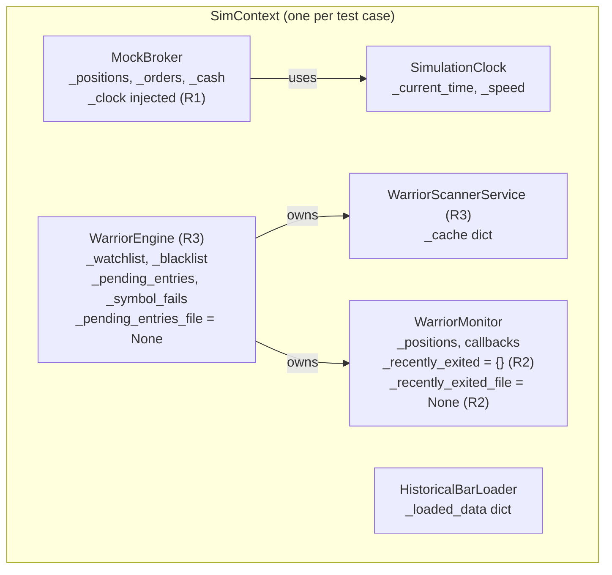

# Concurrent Batch Runner — Architecture Document (v4 — Final)

> **Status:** Roadmap item (not yet started)
> **Estimated effort:** 6 days
> **Expected speedup:** ~15–20x (12+ min → ~40s for 18 cases)
> **Convergence:** 3 rounds of audit/validation — [R1](file:///c:/Users/ftbbo/Nextcloud4/OneDrive%20Backup/Documents%20(sync'd)/Development/Nexus/nexus2/concurrent_runner_audit_report.md) | [R2](file:///c:/Users/ftbbo/Nextcloud4/OneDrive%20Backup/Documents%20(sync'd)/Development/Nexus/nexus2/concurrent_runner_v2_audit_report.md) | [R3](file:///c:/Users/ftbbo/Nextcloud4/OneDrive%20Backup/Documents%20(sync'd)/Development/Nexus/nexus2/concurrent_runner_v3_audit_report.md)

---

## Audit Discovery Summary

| Round | Issues Found | Key Discovery |
|:-----:|:---:|---|
| R1 | 3 critical | `get_simulation_clock()` in 12 files, `trade_event_service` sim flag, no WAL |
| R2 | 2 medium | `_recently_exited` disk persistence, 2 missing callbacks in save/restore |
| R3 | 2 medium | WarriorEngine 5 mutable dicts + disk file, scanner cache contamination |
| **Total** | **7 unique** | All resolved in this document |

---

## Live vs Batch Comparison

| Aspect | Live (Alpaca) | Batch (Current) | Batch (Proposed) |
|--------|------|-----------------|------------------|
| Time | Wall clock | SimulationClock singleton | SimulationClock per-context via ContextVar |
| Prices | Live API chain | BarLoader singleton | BarLoader per-context |
| Broker | Alpaca remote | MockBroker singleton | MockBroker per-context |
| Engine | Global singleton | Same global (hijacked) | New WarriorEngine per-context |
| Scanner | Global, TTL-cached | Same global | New per-context (owned by engine) |
| Monitor | Background asyncio.Task | Manual `_check_all_positions()` | Manual, per-context |
| Concurrency | Multi-symbol, one engine | One case at a time | All cases in parallel |

---

## Complete Isolation Map

Every component that holds mutable state must be isolated per `SimContext`:



### Hidden State Catalog (all rounds)

| State | Owner | Source | Mitigation |
|-------|-------|:------:|------------|
| `_recently_exited` dict | Monitor | R2 | Init empty `{}` per context |
| `_recently_exited_sim_time` dict | Monitor | R2 | Init empty `{}` per context |
| `recently_exited.json` | Monitor | R2 | Set `_recently_exited_file = None` |
| `_watchlist` dict | Engine | R3 | New engine per context |
| `_blacklist` set | Engine | R3 | New engine per context |
| `_pending_entries` dict | Engine | R3 | New engine per context |
| `_symbol_fails` dict | Engine | R3 | New engine per context |
| `stats._seen_candidates` set | Engine | R3 | New engine per context |
| `pending_entries.json` | Engine | R3 | Set `_pending_entries_file = None` |
| `_cache` dict | Scanner | R3 | New scanner per context (owned by engine) |

---

## SimContext Design (v4)

```python
@dataclass
class SimContext:
    """Fully isolated simulation environment for one test case."""
    broker: MockBroker
    clock: SimulationClock
    loader: HistoricalBarLoader
    engine: WarriorEngine       # NEW in v4 (R3)
    monitor: WarriorMonitor     # Owned by engine, but referenced here for convenience
    batch_id: str
    case_id: str
    
    @classmethod
    def create(cls, case_id: str) -> "SimContext":
        clock = SimulationClock()
        
        # MockBroker with injected clock (R1 fix)
        broker = MockBroker(initial_cash=100_000, clock=clock)
        
        # Monitor with clean state (R2 fix)
        monitor = WarriorMonitor()
        monitor.sim_mode = True
        monitor._recently_exited_file = None
        monitor._recently_exited = {}
        monitor._recently_exited_sim_time = {}
        
        # Engine + Scanner per context (R3 fix)
        engine = WarriorEngine(
            config=WarriorEngineConfig(sim_only=True),
            scanner=WarriorScannerService(),
            monitor=monitor,
        )
        engine._pending_entries_file = None  # Disable disk persistence
        
        return cls(
            broker=broker,
            clock=clock,
            loader=HistoricalBarLoader(),
            engine=engine,
            monitor=monitor,
            batch_id=str(uuid4()),
            case_id=case_id,
        )
```

---

## Implementation Phases

### Phase 1: Clock + Service ContextVar (2 days)

**1A: ContextVar for SimulationClock**

Single definition point (`sim_clock.py:L308`). All 12 consumer files use runtime function-level imports (R2 confirmed, R3 reconfirmed). Only 7 call sites in 4 files are in the batch path.

```python
# sim_clock.py
from contextvars import ContextVar
_sim_clock_ctx: ContextVar[Optional[SimulationClock]] = ContextVar('sim_clock', default=None)

def get_simulation_clock() -> SimulationClock:
    ctx_clock = _sim_clock_ctx.get()
    if ctx_clock is not None:
        return ctx_clock
    # Fallback for live/interactive
    global _simulation_clock
    if _simulation_clock is None:
        _simulation_clock = SimulationClock()
    return _simulation_clock
```

**Zero signature changes** in consumer files.

**1B: Clock injection into MockBroker**

`sell_position()` L441 calls `get_simulation_clock()`. Fix: constructor injection.

**1C: trade_event_service ContextVar**

5 call sites use `get_warrior_sim_broker() is not None` as boolean check. Fix: `ContextVar[bool]` for `is_sim_mode`.

**1D: `_recently_exited` isolation** (R2 fix)

Clean dicts + disable file persistence per SimContext.

---

### Phase 2: Engine + Scanner Isolation (1 day) — NEW in v4

Create per-context `WarriorEngine` with its own `WarriorScannerService`.

- Engine `__init__` already accepts `scanner` and `monitor` params
- Disable `_pending_entries_file` disk persistence
- Each engine starts with clean `_watchlist`, `_blacklist`, `_pending_entries`, `_symbol_fails`

---

### Phase 3: Create `step_clock_ctx` (1 day)

Context-aware version using SimContext components. Existing `step_clock()` unchanged for interactive UI.

```python
async def step_clock_ctx(ctx: SimContext, minutes: int):
    for _ in range(minutes):
        ctx.clock.step_forward(minutes=1)
        for symbol in ctx.loader.get_loaded_symbols():
            price = ctx.loader.get_price_at(symbol, ctx.clock.get_time_string())
            if price:
                ctx.broker.set_price(symbol, price)
        await check_entry_triggers(ctx.engine)  # Uses context's engine
        if ctx.monitor._positions:
            await ctx.monitor._check_all_positions()
```

---

### Phase 4: warrior_db + WAL Mode (0.5 day)

- Enable WAL via SQLAlchemy event listener
- Add `batch_run_id` column to `WarriorTradeModel`
- Scoped queries and cleanup

---

### Phase 5: Concurrent Batch Runner (1 day)

```python
async def run_batch_concurrent(cases: list) -> list:
    async def run_single_case(case: dict) -> dict:
        ctx = SimContext.create(case["id"])
        _sim_clock_ctx.set(ctx.clock)       # ContextVar per task
        _is_sim_mode.set(True)
        load_bars(ctx, case)
        wire_batch_callbacks(ctx)           # All 11 callbacks
        await step_clock_ctx(ctx, bar_count + 30)
        eod_close(ctx)
        return collect_results(ctx)
    
    results = await asyncio.gather(
        *[run_single_case(c) for c in cases],
        return_exceptions=True,
    )
    return results
```

Callback wiring covers all 11 (R2 fix — not 9).

---

### Phase 6: Acceptance Testing (0.5 day)

Run sequential and concurrent on same cases. P&L must match exactly.

---

## Risk Assessment (all rounds consolidated)

| Risk | Rating | Source | Mitigation |
|------|:------:|:------:|-----------|
| P&L diverges | HIGH | Design | Acceptance test (Phase 6) |
| Clock coupling (12 files) | HIGH | R1 | ContextVar (Phase 1A) |
| trade_event_service sim flag | HIGH | R1 | ContextVar boolean (Phase 1C) |
| `_recently_exited` bleed | HIGH | R2 | Clean + disable file (Phase 1D) |
| Engine state bleed | MEDIUM | R3 | New engine per context (Phase 2) |
| Scanner cache contamination | MEDIUM | R3 | New scanner per context (Phase 2) |
| MockBroker runtime clock | MEDIUM | R1 | Constructor injection (Phase 1B) |
| SQLite concurrent writes | MEDIUM | R1 | WAL mode (Phase 4) |
| 2 missing callbacks | LOW | R2 | Wire all 11 (Phase 5) |
| Log interleaving | LOW | R3 | Add `[case_id]` prefix |
| File persistence conflicts | LOW | R2+R3 | Disable in batch (Phases 1D, 2) |

## Effort Summary

| Phase | Description | Days |
|-------|-------------|:----:|
| 1 | Clock ContextVar + service isolation + monitor cleanup | 2 |
| 2 | Engine + scanner per-context | 1 |
| 3 | `step_clock_ctx` | 1 |
| 4 | warrior_db WAL + batch_run_id | 0.5 |
| 5 | Concurrent batch runner | 1 |
| 6 | Acceptance testing | 0.5 |
| | **Total** | **6** |

## Performance Projections

| Cases | Sequential | Concurrent | Speedup |
|:-----:|:----------:|:----------:|:-------:|
| 18 | 740s (12 min) | ~45s | **16x** |
| 50 | ~2,050s (34 min) | ~45s | **45x** |
| 100 | ~4,100s (68 min) | ~50s | **82x** |
