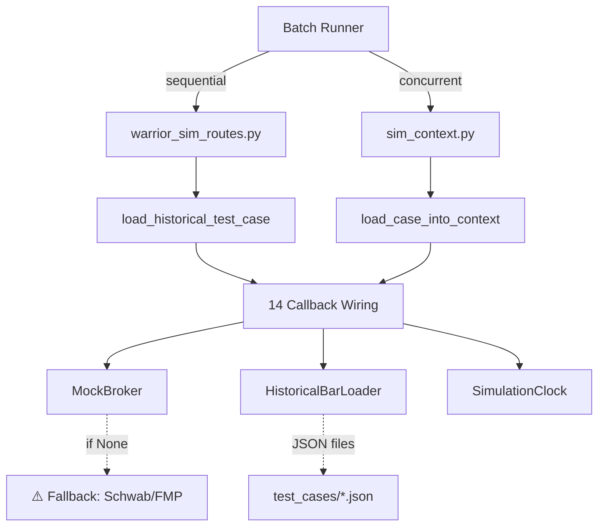
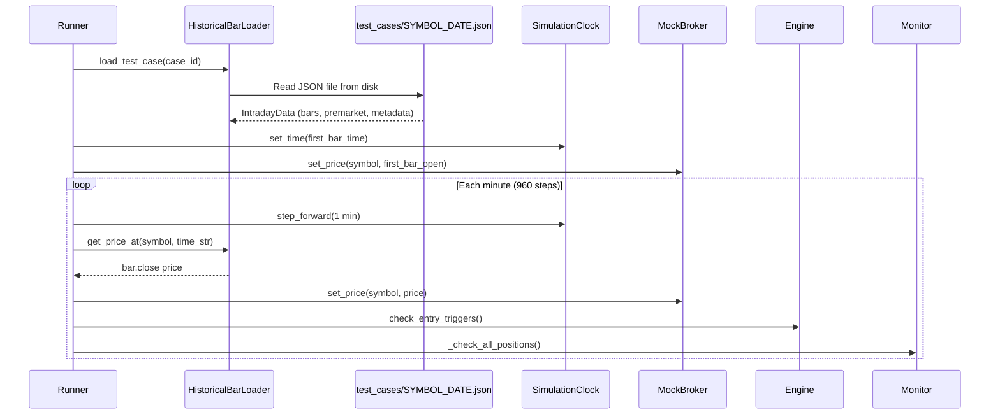

# Batch Runner Performance Audit

**Date:** 2026-02-13  
**Scope:** External data provider calls in batch/concurrent simulation paths

---

## Executive Summary

The batch simulation runner (both sequential and concurrent) is **well-isolated** from external APIs. All 14 engine/monitor callbacks are rewired to simulation implementations (`MockBroker`, `HistoricalBarLoader`, `SimulationClock`). The concurrent runner uses `ProcessPoolExecutor` with per-process isolation including in-memory SQLite. However, **three fallback paths** could theoretically leak API calls if primary sim callbacks return `None`.

---

## Architecture Overview



---

## Data Provider Call Map

### Files with External API References

| File | Provider | Lines | Function | Called in Sim? |
|------|----------|-------|----------|----------------|
| [warrior_engine.py](file:///c:/Users/ftbbo/Nextcloud4/OneDrive%20Backup/Documents%20(sync'd)/Development/Nexus/nexus2/domain/automation/warrior_engine.py#L477-L500) | FMP | 484-489 | `_get_premarket_high` | **No** — bypassed by YAML metadata |
| [warrior_monitor_exit.py](file:///c:/Users/ftbbo/Nextcloud4/OneDrive%20Backup/Documents%20(sync'd)/Development/Nexus/nexus2/domain/automation/warrior_monitor_exit.py#L62-L108) | Schwab, FMP | 84-108 | `_get_price_with_fallbacks` | **Only if MockBroker returns None** |
| [validation.py](file:///c:/Users/ftbbo/Nextcloud4/OneDrive%20Backup/Documents%20(sync'd)/Development/Nexus/nexus2/domain/automation/validation.py#L211-L229) | FMP | 225-229 | `validate_candidate` | **No** — not invoked in entry path |
| [trade_event_service.py](file:///c:/Users/ftbbo/Nextcloud4/OneDrive%20Backup/Documents%20(sync'd)/Development/Nexus/nexus2/domain/automation/trade_event_service.py#L122-L123) | FMP | 122-123 | TML logging | **Guarded** by `sim_mode_ctx` ContextVar |
| [reverse_split_service.py](file:///c:/Users/ftbbo/Nextcloud4/OneDrive%20Backup/Documents%20(sync'd)/Development/Nexus/nexus2/domain/automation/reverse_split_service.py#L151-L152) | FMP | 151-152 | Reverse split check | **Not called** in sim |
| [ipo_service.py](file:///c:/Users/ftbbo/Nextcloud4/OneDrive%20Backup/Documents%20(sync'd)/Development/Nexus/nexus2/domain/automation/ipo_service.py#L85-L86) | FMP | 85-86 | IPO check | **Not called** in sim |

### Simulation Adapter Directory

**Zero** references to `fmp_adapter` or `schwab_adapter` in `nexus2/adapters/simulation/`.

---

## Concurrent Runner Isolation

[sim_context.py](file:///c:/Users/ftbbo/Nextcloud4/OneDrive%20Backup/Documents%20(sync'd)/Development/Nexus/nexus2/adapters/simulation/sim_context.py) provides full process-level isolation:

| Component | Isolation Method |
|-----------|-----------------|
| Database | Per-process in-memory SQLite (L471-482) |
| Broker | `MockBroker` per context (L37) |
| Clock | `SimulationClock` per context (L34) |
| Bar Data | `HistoricalBarLoader` per context (L67) |
| Engine | `WarriorEngine(sim_only=True)` (L57-61) |
| Monitor | Clean `WarriorMonitor()` with `sim_mode=True` (L40-44) |
| Parallelism | `ProcessPoolExecutor` with `spawn` context (L607) |

### 14 Callbacks Wired

All callbacks capture context via default args to prevent cross-context leakage:

1. `get_price` → `MockBroker.get_price` (L281-283)
2. `get_prices_batch` → `MockBroker` loop (L286-292)
3. `execute_exit` → `MockBroker.sell_position` (L295-319)
4. `update_stop` → `MockBroker.update_stop` (L322-335)
5. `get_intraday_candles` → `HistoricalBarLoader.get_bars_up_to` (L338-361)
6. `get_quote_with_spread` → `MockBroker` dict wrapper (L364-374)
7. `_get_broker_positions` → `None` (L388)
8. `_submit_scale_order` → sim order (L450)
9. `_get_order_status` → `None` (L390)
10. `_get_intraday_bars` → `HistoricalBarLoader` (L393)
11. `_get_quote` → `HistoricalBarLoader` + fallback to `MockBroker` (L396-409)
12. `_submit_order` → `MockBroker.submit_bracket_order` (L414-442)
13. `_get_order_status` (engine) → `None` (L447)
14. `on_profit_exit` → `engine._handle_profit_exit` (L384)

---

## Data Flow: How 1-Min Bars Load Per Test Case



**Key:** All bar data comes from local JSON files. No network I/O in the hot loop.

---

## Risk Assessment

### ⚠️ Potential API Leak: `_get_price_with_fallbacks`

> [!WARNING]
> If `MockBroker.get_price()` returns `None` for a symbol during simulation, the fallback chain in `_get_price_with_fallbacks` will attempt Schwab (L84-95) and FMP (L98-108) API calls **without any sim_mode guard**.

**Likelihood:** Low — `load_case_into_context` sets initial price on MockBroker and `step_clock_ctx` updates prices each step. A `None` return would only happen if the HistoricalBarLoader has no bar data for a given time.

**Fix:** Add a sim_mode check at the top of `_get_price_with_fallbacks`:
```python
if monitor.sim_mode:
    return price  # Never fall through to live APIs in sim
```

### ✅ `_get_premarket_high` — Not Reached in Sim

The batch path bypasses `watch_candidate()` entirely. `load_case_into_context` constructs `WatchedCandidate` manually with PMH from YAML metadata (L226: `pmh = Decimal(str(premarket.get("pmh", entry_price)))`). The FMP call at L484-489 is never reached.

### ✅ `PreTradeValidator` — Not Called in Entry Path

`validate_candidate` from `validation.py` is not referenced in `warrior_engine_entry.py` (0 hits for `validate_candidate`, `PreTradeValidator`, or `pre_trade_validation`). This is a live-only validation gate.

### ✅ `trade_event_service.py` — Guarded by ContextVar

Uses `set_sim_mode_ctx(True)` in `_run_single_case_async` (L510) which prevents FMP calls in the trade event logging path.

---

## Performance Characteristics

### Sequential Runner
- Single-threaded async
- Processes 960 one-minute steps per test case
- Steps include entry trigger checks + exit position evaluation
- **Bottleneck:** I/O-bound on bar lookup, but all from in-memory `IntradayData`

### Concurrent Runner  
- `ProcessPoolExecutor` with `spawn` context
- `max_workers = min(len(cases), cpu_count, 8)`
- Each process: own event loop, SimContext, in-memory SQLite
- **True parallelism** (bypasses GIL via multiprocessing)
- Per-case overhead: process spawn + SQLite schema creation

### No External API Bottleneck
Both runners are **CPU-bound**, not I/O-bound. All data comes from:
- JSON files on disk (loaded once into memory)
- MockBroker in-memory state
- SimulationClock arithmetic

---

## Recommendations

1. **Add sim_mode guard to `_get_price_with_fallbacks`** — Prevent any possibility of live API leakage during simulation, even if MockBroker returns None.

2. **Add sim_only guard to `_get_premarket_high`** — Defense in depth. Even though batch bypasses this path, a future code path change could introduce a leak.

3. **No performance optimization needed for data providers** — The batch runner doesn't make external API calls. Performance improvements should focus on:
   - Reducing step count (skip pre-market bars without candidates)
   - Parallel I/O for JSON file loading (currently synchronous `json.load`)
   - Reducing entry trigger evaluation overhead (the hot inner loop)
