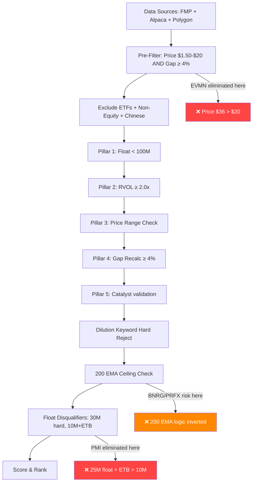

# Scanner Methodology Comparison Report

**Date:** 2026-02-13  
**Agent:** Strategy Registry Expert  
**Methodology:** Warrior (Ross Cameron)  
**Source:** `.agent/strategies/warrior.md`, transcripts Feb 10–12 2026, `warrior_scanner_service.py`

---

## Executive Summary

The Warrior scanner implements a **multi-layered filter pipeline** that is significantly more restrictive than Ross Cameron's actual stock selection process. The scanner currently produces **zero candidates** while Ross trades 2–4 stocks daily. This report identifies **5 false disqualifiers** (scanner rejects stocks Ross would trade) and **3 missing criteria** (things Ross checks that the scanner doesn't).

> [!CAUTION]
> The scanner's filter stack has grown via accumulated "safety" additions beyond Ross's 5 Pillars, creating a pipeline so restrictive that it eliminates virtually everything — including the exact stocks Ross profitably trades.

---

## T1: Ross's Recent Trades — What Attracted Him

### EVMN — Feb 10 (Loss: ~$10,000)

| Attribute | Value | Source |
|-----------|-------|--------|
| **Price** | ~$36 | Transcript: "I got in at $36 a share" |
| **Gap%** | +57% | Transcript: "it is up 57%" |
| **Catalyst** | Phase 2a clinical trial results (eczema drug) | Transcript: "positive phase 2a clinical trial result" |
| **Float** | Unknown (higher, ETB) | Transcript: "easy to borrow and it's higher priced" |
| **Daily Chart** | Blue sky setup, ATH at $24.30 | Transcript: "blue sky setup, all-time highs are 24.30" |
| **Sector** | Biotech / Life Sciences | Transcript: "that's a good sector" |
| **Country** | US | Transcript: "it's a US company" |
| **MACD** | Negative at entry | Transcript: "the MACD was negative but I thought it was going to cross" |

**Why he took it:** Blue sky setup + biotech sector + strong catalyst override the price concern. He acknowledged deviation from his usual price range.

**Scanner would reject:** ❌ Price $36 > max_price $20. Eliminated in **pre-filter** (L688-691) — never even reaches evaluation.

---

### VELO — Feb 10 (Loss: ~$2,000)

| Attribute | Value | Source |
|-----------|-------|--------|
| **Price** | ~$16 | Transcript: "I bought the dip... break of 16, added at 1650" |
| **Gap%** | ~17% | Transcript: "only up 17%" |
| **Catalyst** | Headline (unspecified) | Transcript: "there's a headline there again" |
| **Float** | Unknown | Not mentioned |
| **Country** | US | Transcript: "US company, somewhat recent IPO" |

**Why he took it:** US company + headline + recent IPO + grasping at straws on a cold day. Ross admitted this was a marginal trade.

**Scanner would reject:** Price $16 is within range. Gap 17% passes. Depending on float/RVOL/catalyst validation, this *might* pass or fail on catalyst confidence or float data.

---

### BNRG — Feb 11 (Tiny profit: ~$271)

| Attribute | Value | Source |
|-----------|-------|--------|
| **Price** | ~$4 | Transcript: "if this can reclaim VWAP, we get back over four" |
| **Gap%** | Unknown (was on scanners at 4 AM) | Likely >4% to hit scanners |
| **Catalyst** | Energy/renewable sector activity | Transcript: "energy and renewable energy not my favorite sector" |
| **Float** | Sub-1M shares | Transcript: "sub 1 million share float" |
| **Daily Chart** | Recent reverse split, room to 200 MA | Transcript: "somewhat recent reverse split, room to the 200" |
| **Country** | Israel | Transcript: "Israeli company" |

**Why he took it:** Ultra-low float + reverse split + room to 200 MA. Only the "most obvious stock" on a cold day.

**Scanner would reject:** Depends on catalyst validation. If the AI/regex can't find a strong news headline, this gets rejected as `no_catalyst`. Also, was BELOW VWAP at the time.

---

### PRFX — Feb 11 (Profit: ~$5,970)

| Attribute | Value | Source |
|-----------|-------|--------|
| **Price** | ~$3.22 at scanner alert, entry ~$4.15-$4.50 | Transcript: "PRFX hits the scanner at $3.22... got in at 4, 415, 425, 450" |
| **Gap%** | High (from $3 range, moved to $8+) | >30% during the trading window |
| **Catalyst** | Not explicitly mentioned per-headline | Familiarity + recent reverse split + prior runner |
| **Float** | Sub-1M shares | Transcript: "sub-1 million share float" |
| **Daily Chart** | Recent reverse split, room to 200 MA, prior runner | Transcript: "recent reverse split, room to the 200 moving average... move on it back in January" |
| **Country** | Israel | Transcript: "also an Israeli company" |

**Why he took it:** Ultra-low float + reverse split + prior runner history + room to 200 MA + fast rate of change. This was his best setup of the day.

**Scanner would reject:** Possibly. If catalyst confidence < 0.6 on regex/AI, rejected as `no_catalyst`. Float sub-1M passes easily. Price $3.22 is in range. The "former runner" flag is disabled in settings (`include_former_runners: bool = False`).

---

### PMI — Feb 12 (Profit: ~$9,959)

| Attribute | Value | Source |
|-----------|-------|--------|
| **Price** | ~$1.79 scanner alert, entry ~$2.50 | Transcript: "PMI hits scanner at $1.79, $1.80... jumped in at the half dollar" |
| **Gap%** | Large (from <$2 to $3+) | Scanner showed rapid moves |
| **Catalyst** | Not explicitly stated | Momentum/micro pullback play |
| **Float** | ~25M shares | Transcript: "slightly higher float, 25 million shares" |
| **Country** | US (implied) | Not explicitly stated |

**Why he took it:** Micro pullback pattern + rapid rate of change ("from $2 to $2.20, $2.25, $2.30... that's when I know we've got potential for a big move"). Interestingly, Ross noted the higher float may have HELPED: "shorts felt confident, didn't expect it to go 100%."

**Scanner would reject:** ❌ Price $1.79 at scanner alert is **above** min_price $1.50, so passes. Float 25M passes max_float 100M but could get caught by **high_float_threshold** (30M) or **etb_high_float_threshold** (10M) if ETB. The 25M float + ETB would trigger `etb_high_float` rejection since 25M > 10M threshold.

---

### RDIB — Feb 12 (Loss: ~$5,500)

| Attribute | Value | Source |
|-----------|-------|--------|
| **Price** | ~$2.40 entry | Transcript: "jumped in at about $2.40" |
| **Gap%** | Halted higher | Transcript: "stock had been halted on news... gapping higher" |
| **Catalyst** | News (caused halt) | Transcript: "halted on news" |
| **Float** | Unknown | Not discussed |

**Why he took it:** Halted on news + gapping higher = momentum/halt-resume play. Immediate rejection and drop.

**Scanner status:** This would depend on the news headline parsing and float/RVOL. If the halt was visible to the FMP/Alpaca/Polygon data feeds, it might appear in movers. Catalyst might pass if the halt news was picked up by the data feeds.

---

## T2: Threshold Comparison

| Criterion | Scanner Setting | Ross's Actual Practice | Aligned? | Evidence |
|-----------|-----------------|----------------------|----------|----------|
| **Max Float** | 100M (hard cap), 30M (high_float_threshold reject), 10M (ETB+float reject) | "Sub-1M ideal. Sub-5M strong. >10M thick. >50M = skip" — but trades 25M float PMI | ⚠️ **PARTIALLY** | Max 100M aligns, but the ETB+10M reject is too aggressive. Ross traded PMI at 25M float profitably. |
| **Min RVOL** | 2.0x | Ross doesn't cite a numeric RVOL threshold. He watches for "high volume," "lighter volume" comparisons. | ⚠️ **AMBIGUOUS** | Ross uses volume qualitatively, not as rigid 2x threshold. Some of his trades (VELO) had modest volume. |
| **Gap %** | ≥4% | Ross doesn't use a hard gap minimum. VELO was "only up 17%" (passes), but he takes setups at various gap levels. | ⚠️ **PARTIALLY** | 4% is reasonable but Ross also watches intraday movers that may have started the day flat and squeezed. |
| **Price range** | $1.50–$20 | "Preferred $4–$20. Will trade outside range if other factors strong." EVMN at $36, PMI at $1.79. | ❌ **MISALIGNED** | Ross trades above $20 (EVMN $36 with blue sky), and below $2 (PMI $1.79). The range is too rigid. |
| **Catalyst req** | AI-validated, confidence ≥0.6 | "Breaking news strongly preferred. No-news = B-quality." But trades PRFX on familiarity + RS + prior runner, no specific headline. | ⚠️ **PARTIALLY** | Ross's catalyst can be "I know this ticker, it's a former runner with a reverse split." Scanner requires parseable headline. |
| **200 EMA check** | Enabled, reject if <15% room to 200 EMA | Ross WANTS room to 200 MA ("room to the 200") but as upside target, not rejection. He specifically looks FOR stocks below 200 EMA with room to run TO it. | ❌ **INVERTED LOGIC** | Ross says "room to the 200" as BULLISH. Scanner rejects stocks near 200 EMA. These are opposite meanings. |
| **MACD check** | Not used in scanner (settings exist for future) | MACD is confirmation/exit indicator, not entry gate. Ross entered EVMN with negative MACD. | ✅ **ALIGNED** | MACD is not currently a scanner filter (correctly). |
| **Chinese stock block** | Hard block (with icebreaker exception) | "avoid Chinese stocks" — but trades Israeli stocks freely (BNRG, PRFX, RVSN) | ✅ **ALIGNED** | Chinese block is correct. Israeli stocks not blocked (correct). |
| **ETB + high float** | Reject if ETB && float > 10M | Ross avoids "easy to borrow + no news = guaranteed fade" but his threshold is more like 35M+, not 10M. And he still trades ETB stocks with strong catalysts. | ❌ **TOO AGGRESSIVE** | Ross: "easy to borrow and 35M float = choppy." Scanner uses 10M, 3.5x more restrictive. |
| **Dilution keywords** | Hard reject on any dilution keyword | Ross: "private placements can be bullish" and explicitly noted ASBP's private placement could work. | ❌ **TOO AGGRESSIVE** | Scanner rejects all dilution keywords. Ross sees some as neutral/bullish. |

---

## T3: False Disqualifiers (Scanner Filters Ross Does NOT Use)

### 🔴 FD1: Price Cap at $20 (CRITICAL)

**Impact:** Eliminates EVMN ($36, +57%, blue sky biotech)

Ross explicitly trades above $20 when the daily chart setup is compelling:
> "A blue sky setup can work really nicely and it's the right sector. So I was okay with it being a little higher priced."

He does prefer $4–$20, but it's a **preference score**, not a hard reject. The pre-filter at L688-691 eliminates anything above $20 before it even reaches the evaluation pipeline. There's no override mechanism for exceptional setups.

**Recommendation:** Change max_price pre-filter to a soft penalty (score reduction) rather than hard elimination. Or raise to $35–$40 with a score penalty above $20.

---

### 🔴 FD2: ETB + Float > 10M Reject (CRITICAL)

**Impact:** Would eliminate PMI ($9,959 profit trade, 25M float, likely ETB)

The scanner rejects any ETB stock with float > 10M. Ross's documented threshold is dramatically higher:
> "Easy to borrow + 35M float = choppy, fake-outs, shorts will flush it"

The scanner uses this quote but applies a 10M threshold instead of the stated 35M. Ross traded PMI profitably at 25M float and specifically noted the higher float helped because shorts were overconfident.

**Recommendation:** Raise `etb_high_float_threshold` from 10M to 35M to match Ross's actual stated threshold.

---

### 🔴 FD3: 200 EMA Logic is Inverted (CRITICAL)

**Impact:** Rejects stocks that are exactly what Ross wants

The scanner rejects stocks if the 200 EMA is "too close overhead" (<15% room). But Ross explicitly seeks stocks with "room to the 200 moving average" — meaning stocks BELOW the 200 EMA that can run UP to it.

Ross on BNRG: "sub 1 million share float, somewhat recent reverse split, **room to the 200**"  
Ross on PRFX: "recent reverse split, **room to the 200 moving average**"

Both stocks were **below** the 200 EMA. Ross sees this as a **target**, not a ceiling. The scanner treats the 200 EMA as overhead resistance and rejects stocks near it.

**Recommendation:** Invert the 200 EMA logic:
- **Current:** Reject if price is below 200 EMA and within 15% → Wrong
- **Correct:** Award BONUS points if price is below 200 EMA (upside target). Only reject if price is ABOVE 200 EMA by a lot (blue sky is preferred, extended above 200 EMA is not disqualifying).

---

### 🟡 FD4: Dilution Keyword Hard Reject

**Impact:** Could eliminate stocks with private placements that Ross considers bullish

Ross on ASBP (Feb 11): "the news is a private placement. Now, **private placements can be bullish.**"

The scanner has a hard block on all dilution keywords including "private placement." Ross considers context — a private placement on a reverse-split stock with a positive catalyst is different from a secondary offering on a failing company.

**Recommendation:** Make dilution rejection context-dependent:
- Private placement on a reverse-split stock with positive catalyst → bypass (already partially implemented for RS bypass)  
- Pure offerings without other catalysts → reject

---

### 🟡 FD5: Former Runner Disabled

**Impact:** PRFX would not get catalyst credit from being a known runner

The setting `include_former_runners: bool = False` disables the former-runner catalyst pathway. But Ross explicitly cited PRFX's prior run as a reason for interest:
> "It's a stock I'm familiar with. I'm familiar with it because I've traded it in the past."

Combined with the reverse split and room to 200, the "former runner" status was part of why Ross found it attractive even without a specific headline.

**Recommendation:** Enable `include_former_runners = True` or at minimum use it as a score boost (not full catalyst substitute).

---

## T4: Missing Criteria (Things Ross Checks That Scanner Doesn't)

### MC1: Rate of Change (Pillar 3)

Ross's actual Pillar 3 is "Rate of Change" — how fast the price is moving intraday:
> "From $4 to $8 in 20 seconds — that's incredible"

The scanner has no rate-of-change measurement. A stock could gap 10% at 4 AM and drift sideways for 3 hours, and the scanner would still show it as a "10% gapper." Ross watches for stocks that are actively moving fast RIGHT NOW.

**Recommendation:** Add an intraday momentum metric measuring price velocity over the last 5–15 minutes.

---

### MC2: Blue Sky Detection (No Overhead Supply)

Ross specifically values "blue sky" setups — stocks at or near all-time highs with no overhead resistance:
> "all-time highs are $24.30... this is the type of daily chart that can actually give us a pretty nice move"

The scanner has a `year_high` field defined in `WarriorCandidate` but never calculates or uses it for scoring. Blue sky is a significant conviction boost in Ross's framework.

**Recommendation:** Calculate proximity to 52-week/all-time high and add as a score bonus.

---

### MC3: Spread Quality (Bid/Ask)

Ross explicitly checks the spread before entering:
> "I pull up the level two... the spread was like 850 by 725 by 850. So it was a really big spread. And I just thought, well, I can't trade that."

The scanner doesn't evaluate spread quality. A stock could pass all 5 pillars but be untradeable due to wide spreads.

**Recommendation:** Add spread check during entry evaluation (may be more appropriate in the entry engine than the scanner, but could be a disqualifier at scan time).

---

## Summary: Filter Pipeline vs Ross's Process

### Ross's Actual Process (for comparison):

1. **Scanner audio alert** → something is moving
2. **Click ticker** → look at chart, price, volume
3. **Check news** → is there a catalyst?
4. **Pull up Level 2** → check spread, order flow
5. **Daily chart** → blue sky? room to 200? reverse split? prior runner?
6. **Gut check** → does this feel right given market temperature?
7. **Enter** or **skip**

Key difference: Ross's process is **inclusive-then-evaluate** (see everything, then decide). The scanner is **exclusive-then-score** (eliminate most things, then score survivors). With the current filter stack, nothing survives.

---

## Prioritized Recommendations

| Priority | Issue | Fix | Impact |
|----------|-------|-----|--------|
| 🔴 P0 | ETB+Float 10M threshold | Raise to 35M (match Ross's stated threshold) | Unblocks PMI-type trades |
| 🔴 P0 | 200 EMA logic inverted | Reverse: below 200 = BONUS, not rejection | Unblocks BNRG/PRFX types |
| 🔴 P1 | Price cap $20 hard reject | Soft penalty above $20, hard cap $40 | Unblocks EVMN-type trades |
| 🟡 P1 | Former runner disabled | Enable as score boost (not catalyst substitute) | Helps PRFX-type trades |
| 🟡 P2 | Dilution keyword blanket | Context-dependent (already partially done for RS) | Reduces false rejections |
| 🟢 P2 | Blue sky detection missing | Add 52-week high proximity as score bonus | Improves scoring accuracy |
| 🟢 P3 | Rate of change missing | Add intraday velocity metric | Better aligns with Ross's Pillar 3 |
| 🟢 P3 | Spread check missing | Add bid/ask spread quality check | Prevents bad entries |

---

> [!IMPORTANT]
> **The top 3 fixes (ETB threshold, 200 EMA logic, price cap) are parameter changes that require no architectural work.** They can be implemented as settings adjustments and would immediately increase the scanner's alignment with Ross's actual methodology.

---

## Confidence Assessment

| Section | Confidence | Source |
|---------|-----------|--------|
| T1: Trade details | **HIGH** | Direct transcript quotes |
| T2: Threshold comparison | **HIGH** | Code + transcript cross-reference |
| T3: False disqualifiers | **HIGH** | Code analysis + transcript evidence |
| T4: Missing criteria | **MEDIUM** | Transcript-inferred, some criteria may exist elsewhere |
| Recommendations | **HIGH** | Evidence-backed with specific code locations |

---

**Source Files:**
- [warrior.md](file:///c:/Users/ftbbo/Nextcloud4/OneDrive%20Backup/Documents%20%28sync%27d%29/Development/Nexus/.agent/strategies/warrior.md)
- [warrior_scanner_service.py](file:///c:/Users/ftbbo/Nextcloud4/OneDrive%20Backup/Documents%20%28sync%27d%29/Development/Nexus/nexus2/domain/scanner/warrior_scanner_service.py)
- [Feb 10 transcript](file:///c:/Users/ftbbo/Nextcloud4/OneDrive%20Backup/Documents%20%28sync%27d%29/Development/Nexus/.agent/knowledge/warrior_trading/2026-02-10_transcript_5Xbf_JuO-mE.md)
- [Feb 11 transcript](file:///c:/Users/ftbbo/Nextcloud4/OneDrive%20Backup/Documents%20%28sync%27d%29/Development/Nexus/.agent/knowledge/warrior_trading/2026-02-11_transcript_HYK2eKkViJs.md)
- [Feb 12 transcript](file:///c:/Users/ftbbo/Nextcloud4/OneDrive%20Backup/Documents%20%28sync%27d%29/Development/Nexus/.agent/knowledge/warrior_trading/2026-02-12_transcript_5yS8i0-aMvI.md)
