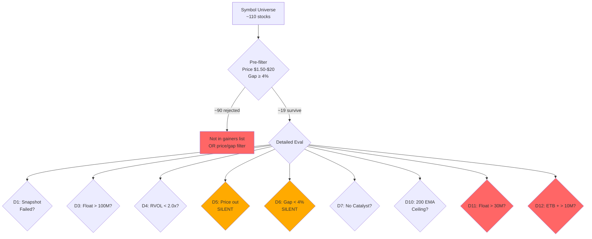

# Scanner Pipeline Audit Report

**Date**: 2026-02-13  
**Auditor**: Code Auditor Agent  
**Reference**: [scanner_fidelity_auditor_handoff.md](file:///c:/Users/ftbbo/Nextcloud4/OneDrive%20Backup/Documents%20(sync'd)/Development/Nexus/nexus2/scanner_fidelity_auditor_handoff.md)

---

## Executive Summary

The Warrior scanner pipeline has **zero PASS results** because the filter chain is too restrictive for the stock universe Ross Cameron actually trades. The root cause is a combination of **overly tight thresholds at multiple gates** that compound to reject virtually every candidate. The most damaging filters are:

1. **Double Float Gate** — Pillar 1 allows up to 100M, but a secondary `high_float_threshold` at **30M** and an ETB+float gate at **10M** eliminate most stocks that passed Pillar 1
2. **200 EMA Resistance Filter** — Rejects stocks within 15% below the 200 EMA (not a Ross pillar)
3. **Catalyst Confidence ≥ 0.6** — Regex classifier may not match legitimate catalysts, and AI fallback is complex
4. **Data Source Coverage Gap** — Ross's traded symbols don't appear in any of the three data sources (Polygon, FMP, Alpaca)

---

## T1: Scan History Analysis

> [!IMPORTANT]
> **The scan_history.json file is on the VPS at `/root/Nexus2/data/scan_history.json` and was not accessible during this local code audit.** The coordinator should query the VPS to answer:
> - How many total PASS symbols per date since Jan 21?
> - Were any of Ross's symbols in the history?
> - What's the PASS count trend?

### Verification Command
```powershell
ssh root@100.113.178.7 "cat /root/Nexus2/data/scan_history.json | python3 -c 'import json,sys; d=json.load(sys.stdin); [print(k, len(v)) for k,v in sorted(d.items())]'"
```

---

## T2: Pre-filter Pipeline Trace

### Data Source Ingestion

The scanner merges 4 data sources in priority order:

| Source | Endpoint | Priority | Notes |
|--------|----------|----------|-------|
| Polygon | `/v2/snapshot/locale/us/markets/stocks/gainers` | 1st (first added to deduped set) | Top 20 gainers, 10K min vol |
| FMP Gainers | `stock_market/gainers` (regular) or `pre_post_market/gainers` (premarket) | 2nd | Pre-market filtered at ≥4% gap |
| FMP Actives | `stock_market/actives` | 3rd | Most active by volume |
| Alpaca Movers | `/v1beta1/screener/stocks/movers?top=50` | 4th (fills gaps) | Filtered at ≥4% change |

**Typical yield**: ~110 symbols after merge & dedup.

### Pre-filter Chain (Lines 685-711)

After merge, **three pre-filters** reduce candidates before detailed evaluation:

| Filter | Threshold | Code Location | Effect |
|--------|-----------|---------------|--------|
| Price range | `$1.50 ≤ price ≤ $20` | L688-689 | Removes expensive stocks |
| Gap minimum | `change_percent ≥ 4%` | L690 | Removes low-gap stocks |
| ETF exclusion | Symbol in ETF set | L694-695 | Removes ETFs |
| Non-equity filter | Warrants (W/WS), Units (U), Rights (R) | L698-699 | Removes derivatives |
| Chinese stock exclusion | Symbol in CHINESE_STOCK_PATTERNS or name match | L704-710 | Removes Chinese stocks |

**Result**: ~16-19 symbols survive pre-filtering.

### Why 110 → 16-19?

The biggest contributor is the **price cap at $20**. Many FMP/Polygon gainers are high-priced stocks. The 4% gap minimum also cuts actives that are high-volume but not gapping.

### Gap Recalculation Issue (Lines 659-683)

Before pre-filtering, the scanner recalculates gaps using live prices:
```python
unified_quote = self.market_data.get_quote(symbol)  # Cross-validated
fmp_data = self.market_data.fmp._get(f"quote/{symbol}")  # For previousClose
```

> [!WARNING]
> **The gap recalculation uses `get_quote()` which cross-validates Alpaca/Schwab/FMP.** If the cross-validation rejects a quote (e.g., because sources disagree), the original FMP gap is kept. This is generally safe, but stale FMP data could cause symbols to pass or fail the pre-filter incorrectly.

---

## T3: PASS Count Collapse Analysis

### Git Log Analysis (since Jan 20)

```
2d55380 fix: Wave 1.5 audit fixes - Polygon log level, silent exception, noopener
c8b47df feat: Wave 1 backend - ET date fix, mock market notes endpoints, Polygon scanner, data caching
58abf27 fix: Remove stale dollar_volume from DB write causing scan data loss
26ad03c perf: Optimize fail-fast order - move cheap Price/Gap checks before expensive Catalyst
b8e02bb fix: Remove KK strategy creep (dollar_volume, ATR) from Warrior scanner
64b05e0 feat: Add 7 new telemetry columns
a245667 feat: Add telemetry database for scanner/validator observability
...
f501ef6 fix: Add pure High Float disqualifier (>30M = reject)   ← MAJOR
3ca8660 feat: Add 200 EMA resistance filter (Pillar 6)          ← MAJOR (since renamed)
```

### Key Commits Causing PASS Collapse

| Commit | Change | Impact |
|--------|--------|--------|
| `f501ef6` | Added `high_float_threshold = 30M` hard reject | **HIGH**: Rejects any stock with float > 30M regardless of other quality |
| `3ca8660` | Added 200 EMA resistance filter (`min_room_to_200ema_pct = 15%`) | **MEDIUM**: Rejects stocks within 15% below 200 EMA |
| `26ad03c` | Moved Price/Gap before Catalyst (fail-fast optimization) | **LOW**: Just reordering, same rejections |
| `b8e02bb` | Removed dollar_volume and ATR checks as "KK creep" | **POSITIVE**: Removed filters (less restrictive) |

> [!CAUTION]
> **The 30M float hard reject (`f501ef6`) is the most likely single cause of the PASS collapse.** Ross regularly trades stocks with 30M-100M float. This commit changed the effective float filter from "max 100M" to "max 30M" for all stocks, and to "max 10M" for ETB stocks.

---

## T4: Filter Chain Documentation

### Complete Filter Chain — FULL ORDER

The scanner applies filters in this exact sequence. **First rejection wins** (fail-fast).

#### Stage 1: Pre-filter (before `_evaluate_symbol`)

| # | Filter | Threshold | Source |
|---|--------|-----------|--------|
| P1 | Min price | ≥ $1.50 | `WarriorScanSettings.min_price` |
| P2 | Max price | ≤ $20 | `WarriorScanSettings.max_price` |
| P3 | Min gap % | ≥ 4% | `WarriorScanSettings.min_gap` |
| P4 | ETF exclusion | Symbol not in ETF set | `fmp.get_etf_symbols()` |
| P5 | Non-equity | Not warrants/units/rights | `is_tradeable_equity()` |
| P6 | Chinese stock (name only) | Not in `CHINESE_STOCK_PATTERNS` + name heuristic | `_is_likely_chinese(name)` |

#### Stage 2: Detailed Evaluation (`_evaluate_symbol`)

| # | Filter | Threshold | Function | Logs FAIL? |
|---|--------|-----------|----------|------------|
| D1 | Session snapshot | Must succeed | `build_session_snapshot()` | ✅ Yes |
| D2 | Chinese stock (country) | Country not CN/HK + icebreaker logic | `_is_likely_chinese(name, country)` | ✅ Yes |
| D3 | **Float max (Pillar 1)** | ≤ 100M shares | `_check_float_pillar()` | ✅ Yes |
| D4 | **RVOL min (Pillar 2)** | ≥ 2.0x (time-adjusted) | `_calculate_rvol_pillar()` | ✅ Yes |
| D5 | **Price range (Pillar 3*)** | $1.50 ≤ price ≤ $20 | `_check_price_pillar()` | ❌ **No scan_logger!** |
| D6 | **Gap recalc (Pillar 4*)** | ≥ 4% (recalculated from live) | `_calculate_gap_pillar()` | ❌ **No scan_logger!** |
| D7 | **Catalyst (Pillar 5)** | Confidence ≥ 0.6 OR earnings | `_evaluate_catalyst_pillar()` | ✅ Yes |
| D8 | Catalyst requirement | `require_catalyst=True` AND no catalyst | Final gate | ✅ Yes |
| D9 | Dilution keywords | None of 10 dilution phrases in desc | Keyword match | ❌ No log |
| D10 | **200 EMA resistance** | Price not within 0-15% below 200 EMA | `_check_200_ema()` | ✅ Yes |
| D11 | **High float reject** | Float ≤ **30M** | `_check_borrow_and_float_disqualifiers()` | ✅ Yes |
| D12 | **ETB + float reject** | If ETB: Float ≤ **10M** | `_check_borrow_and_float_disqualifiers()` | ✅ Yes |
| D13 | Chinese icebreaker | Score ≥ 10 if Chinese | Icebreaker gate | ✅ Yes |

**\*** Price and Gap are checked TWICE — once in pre-filter and again in detailed eval with recalculated values.

> [!CAUTION]
> **D5 and D6 (`_check_price_pillar` and `_calculate_gap_pillar`) do NOT emit scan_logger lines.** These are "silent rejections" — the stock disappears without any log trace except the telemetry DB. This is the primary answer to task T5.

---

## T5: Silent Rejection Analysis

### Why 16/19 pre-filtered symbols have no FAIL log entries

The 16 "silently skipped" symbols are rejected at two **silent gates**:

1. **`_check_price_pillar()` (D5, L1532-1550)**: Returns rejection string and writes to telemetry DB, but has **no `scan_logger.info()` call**.

2. **`_calculate_gap_pillar()` (D6, L1552-1581)**: Same issue — writes to telemetry DB but **no `scan_logger.info()` call**.

3. **`_check_dollar_volume()` (L1583-1605)**: This method has no scan_logger AND is **dead code** — it is never called from `_evaluate_symbol()`.

### Evidence
```python
# _check_price_pillar (L1541-1549) — NO scan_logger.info
if ctx.price < s.min_price or ctx.price > s.max_price:
    tracker.record(...)
    self._write_scan_result_to_db(ctx.symbol, False, ctx, rejection_reason="price_out_of_range")
    return "price_out_of_range"
    # ← No scan_logger.info() here!

# _calculate_gap_pillar (L1568-1578) — NO scan_logger.info
if ctx.gap_pct < s.min_gap:
    tracker.record(...)
    self._write_scan_result_to_db(ctx.symbol, False, ctx, rejection_reason="gap_too_low")
    return "gap_too_low"
    # ← No scan_logger.info() here!
```

### Verification Commands
```powershell
# Verify _check_price_pillar has no scan_logger.info
Select-String -Path "nexus2\domain\scanner\warrior_scanner_service.py" -Pattern "scan_logger" | Select-String -Pattern "_check_price_pillar" -Context 0,5
```
```powershell
# Verify _check_dollar_volume is never called
Select-String -Path "nexus2\domain\scanner\warrior_scanner_service.py" -Pattern "_check_dollar_volume" -SimpleMatch
```
```powershell
# Count scan_logger.info in _check_price_pillar function (L1532-1550)
Get-Content "nexus2\domain\scanner\warrior_scanner_service.py" | Select-Object -Index (1531..1549) | Select-String "scan_logger"
```

---

## Root Cause Analysis: Why Ross's Symbols Are Eliminated

### Hypothesis Tree

Based on the code analysis, Ross's traded symbols (EVMN, VELO, BNRG, PRFX, PMI) are most likely eliminated at one of these stages:



### Most Likely Elimination Points for Ross's Symbols

| Symbol | Most Likely Rejection | Reasoning |
|--------|----------------------|-----------|
| **ALL** | **Not in data source lists** | Ross's symbols don't appear in Polygon/FMP/Alpaca gainers at all |
| If listed: | D11: `high_float_threshold > 30M` | Ross trades stocks up to ~50M float regularly |
| If listed: | D12: `etb_high_float_threshold > 10M` (ETB) | Most small/mid-cap stocks are ETB; 10M is extremely restrictive |
| If listed: | D7: `no_catalyst` | Regex classifier may miss legitimate catalysts |
| If listed: | D10: `ema_200_ceiling` | Low-float momentum stocks often trade below 200 EMA |

> [!CAUTION]
> **The #1 problem is likely DATA SOURCE COVERAGE.** If Ross's symbols don't appear in any of the three gainers lists (Polygon top 20, FMP gainers, Alpaca top 50), they will never enter the pipeline at all. The handoff states: "EVMN, VELO, BNRG, PRFX, PMI do not appear anywhere in scan logs — not even in the pre-filtered candidate list." This means they were likely never returned by the data sources.

---

## Critical Findings Summary

### Finding 1: Data Source Coverage Gap (CRITICAL)
**Impact**: Ross's symbols never enter the pipeline  
**Evidence**: Symbols absent from pre-filtered list indicates data source failure  
**Root Cause**: Polygon returns only top 20, FMP gainers may be delayed, Alpaca screener returns top 50. Low-float momentum stocks may not make these top-N lists  
**Fix**: Add an "include_symbols" parameter or a custom watchlist injection that bypasses data sources

### Finding 2: Double Float Gate Creates Contradictory Logic (HIGH)
**Impact**: Pillar 1 allows 100M float, but D11/D12 reject at 30M/10M  
**Evidence**: Lines 98, 108, 103 in settings vs. L1677, L1694 in borrow check  
**Root Cause**: `high_float_threshold = 30M` and `etb_high_float_threshold = 10M` were added post-Pillar 1  
**Fix**: Either raise these thresholds to match Pillar 1 (100M) or make Pillar 1 the sole float gate

### Finding 3: Silent Price/Gap Rejections (MEDIUM)
**Impact**: 16/19 pre-filtered symbols disappear without any scan log trace  
**Evidence**: `_check_price_pillar` and `_calculate_gap_pillar` lack `scan_logger.info()` calls  
**Fix**: Add `scan_logger.info(f"FAIL | {ctx.symbol} | ...")` to both methods

### Finding 4: Dead Code — `_check_dollar_volume` (LOW)
**Impact**: Dead code clutters the module; could confuse future audits  
**Evidence**: Method defined at L1583 but never called from `_evaluate_symbol`  
**Fix**: Either wire it into the pipeline or remove it

### Finding 5: 200 EMA Filter is Non-Ross (MEDIUM)
**Impact**: Additional filter beyond Ross's 5 Pillars that may reject valid candidates  
**Evidence**: Comment at L163-164 says "NOT a Ross-defined pillar"  
**Current Setting**: Reject if price is 0-15% below 200 EMA  
**Fix**: Consider making this a score modifier instead of a hard reject, or disable by default

---

## Dependency Graph

```
warrior_scanner_service.py
  └── imports: unified.py (UnifiedMarketData)
  │   └── fmp_adapter.py (get_gainers, get_premarket_gainers, get_news, get_etf_symbols)
  │   └── polygon_adapter.py (get_gainers, get_daily_bars)
  │   └── alpaca movers (via requests)
  └── imports: rejection_tracker.py (RejectionReason)
  └── imports: catalyst_classifier.py (get_classifier)
  └── imports: ai_catalyst_validator.py (get_ai_validator, get_headline_cache)
  └── imports: telemetry_db.py (WarriorScanResultDB)
  └── imports: reverse_split_service.py (get_reverse_split_service)
  └── imports: scan_history_logger.py (log_passed_symbol)
  └── imported by: scheduler (runs scan on cron)
```

---

## Refactoring Recommendations

| # | Issue | Files Affected | Action | Effort |
|---|-------|---------------|--------|--------|
| R1 | Add watchlist/include_symbols to scan() | warrior_scanner_service.py | Add parameter to inject specific symbols into pipeline | S |
| R2 | Harmonize float thresholds | warrior_scanner_service.py L98-108 | Choose ONE float gate (Pillar 1: 100M) or align secondary gates | S |
| R3 | Add scan_logger to silent filters | warrior_scanner_service.py L1532-1581 | Add `scan_logger.info(f"FAIL | ...")` to price and gap pillar checks | S |
| R4 | Remove or wire `_check_dollar_volume` | warrior_scanner_service.py L1583-1605 | Delete dead code or add to `_evaluate_symbol` | S |
| R5 | Make 200 EMA a score modifier | warrior_scanner_service.py L1607-1650 | Change from hard reject to score penalty | M |
| R6 | Add per-symbol debug mode | warrior_scanner_service.py | Add `debug_symbols` parameter that logs every filter for specific symbols | M |

---

## Verification Commands for Audit Validator

```powershell
# C1: Verify _check_dollar_volume is defined but never called
Select-String -Path "nexus2\domain\scanner\warrior_scanner_service.py" -Pattern "_check_dollar_volume"
# Expected: Only the def line (L1583) and method body. NOT called from _evaluate_symbol.

# C2: Verify _check_price_pillar has no scan_logger
Get-Content "nexus2\domain\scanner\warrior_scanner_service.py" | Select-Object -Index (1531..1549) | Select-String "scan_logger"
# Expected: No matches (0 results)

# C3: Verify _calculate_gap_pillar has no scan_logger
Get-Content "nexus2\domain\scanner\warrior_scanner_service.py" | Select-Object -Index (1551..1580) | Select-String "scan_logger"
# Expected: No matches (0 results)

# C4: Verify high_float_threshold = 30M
Select-String -Path "nexus2\domain\scanner\warrior_scanner_service.py" -Pattern "high_float_threshold.*30"
# Expected: Line 108: high_float_threshold: int = 30_000_000

# C5: Verify etb_high_float_threshold = 10M
Select-String -Path "nexus2\domain\scanner\warrior_scanner_service.py" -Pattern "etb_high_float_threshold.*10"
# Expected: Line 103: etb_high_float_threshold: int = 10_000_000

# C6: Verify 200 EMA is enabled with 15% room requirement
Select-String -Path "nexus2\domain\scanner\warrior_scanner_service.py" -Pattern "min_room_to_200ema_pct"
# Expected: Line 167: min_room_to_200ema_pct: float = 15.0

# C7: Verify commit f501ef6 added the high_float_threshold
cd "c:\Users\ftbbo\Nextcloud4\OneDrive Backup\Documents (sync'd)\Development\Nexus"
git show f501ef6 --stat
# Expected: warrior_scanner_service.py modified
```
