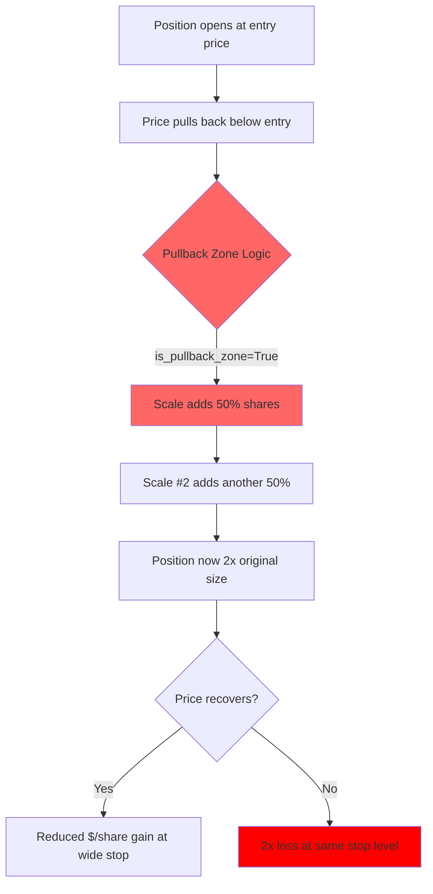

# Fix 5 Scaling Regression: Trace Log Findings

**Date:** 2026-02-16  
**Regression:** $13,298 → $9,796 (-26%, -$3,502)  
**Method:** Trace logging via file handlers in subprocess workers

## Executive Summary

My original hypothesis (**scaling interferes with Fix 1 partial-then-ride**) was **WRONG**.  
The trace data reveals a different root cause: **the pullback zone logic causes averaging down**.

---

## Finding 1: Fix 1 Interaction Hypothesis — DISPROVEN

**Claim:** Scaling adds shares back after `partial_taken=True`, re-expanding home_run positions.

**Evidence:** ALL 23 scale events show `partial_taken=False`:

```
[TNMG] SCALE EXECUTED — scale #1, shares 206→309, partial_taken=False, exit_mode=home_run
[TNMG] SCALE EXECUTED — scale #2, shares 309→412, partial_taken=False, exit_mode=home_run
[GWAV] SCALE EXECUTED — scale #1, shares 384→576, partial_taken=False, exit_mode=home_run
[BATL] SCALE EXECUTED — scale #1, shares 1315→1972, partial_taken=False, exit_mode=home_run
[ROLR] SCALE EXECUTED — scale #1, shares 66→99, partial_taken=False, exit_mode=base_hit
```

**Conclusion:** Scaling always fires BEFORE any partial exit occurs. The pullback zone is too far from entry for scaling to trigger after partials.

---

## Finding 2: Scaling = Averaging Down (TRUE ROOT CAUSE)

The pullback zone logic (Fix 5B) creates a scale zone at 50% of entry-to-support range. This means **scaling only happens when price is BELOW entry** — adding to a losing position.

| Symbol | Entry | Scale Price | % Below Entry | Shares Before → After |
|--------|-------|-------------|--------------|----------------------|
| TNMG | $3.43 | $2.75 | -19.8% | 206 → 412 (2x) |
| ROLR | $16.07 | $14.14 | -12.0% | 66 → 99 (1.5x) |
| GWAV | $5.68 | $5.20 | -8.5% | 384 → 768 (2x) |
| FLYE | $7.11 | $5.66 | -20.4% | 87 → 173 (2x) |
| MNTS | $7.67 | $6.75 | -12.0% | 138 → 276 (2x) |
| LCFY | $4.96 | $4.71 | -5.0% | 555 → 1109 (2x) |
| BATL | $3.22 | $3.11 | -3.4% | 1315 → 2629 (2x) |
| PRFX | $2.96 | $2.83 | -4.4% | 1136 → 2272 (2x) |

> [!CAUTION]
> **This is averaging down — explicitly banned by Ross Cameron's methodology.**  
> Ross adds on STRENGTH (new highs with volume), never on pullbacks below entry.

---

## Finding 3: Scaling During Home Run Mode

5 symbols scale while `exit_mode_override=home_run`. These positions have already hit their target and are being trailed — they should be **winding down**, not adding shares:

```
TNMG:  exit_mode=home_run, scale at $2.75 (entry $3.43) — adding to a trailing position!
GWAV:  exit_mode=home_run, scale at $5.20 (entry $5.68) — same issue
VELO:  exit_mode=home_run, scale at $14.15 (entry $14.90)
PRFX:  exit_mode=home_run, scale at $2.83 (entry $2.96)
BATL:  exit_mode=home_run, scale at $3.11 (entry $3.22)
```

---

## Finding 4: Stops Don't Move to Breakeven

After scaling, `current_stop` stays at its original value. `move_stop_to_breakeven_after_scale` appears to be `False`:

```
TNMG: scale at $2.75, stop stays at $2.19 (NOT moved to entry $3.43)
GWAV: scale at $5.20, stop stays at $5.00 (NOT moved to entry $5.68)
ROLR: scale at $14.14, stop stays at $12.28 (NOT moved to entry $16.07)
```

This means larger positions hit the same wide stop → **amplified losses**.

---

## Finding 5: VERO Has Stealth Scales Via Re-Entry Path

VERO does NOT appear in SCALE EXECUTED events, but the CHECKPOINT trace shows share count jumps:
- Trade 1: 384 → 674 shares (entry $2.83 → $2.92)
- Trade 2: 520 → 923 shares (entry $3.59 → $3.65)

Entry price goes UP, not down — this is **re-entry consolidation**, not pullback scaling.  
The re-entry system increments `scale_count`, which could block legitimate scaling later.

---

## Regression Mechanism



---

## Recommendations

### Immediate: Disable Fix 5
Set `enable_improved_scaling = False` (restore baseline $13,298).

### For Future Scaling Logic
1. **Never scale below entry** — only add on confirmation (new highs)
2. **Block scaling in `home_run` mode** — trailing positions should wind down
3. **Block scaling after `partial_taken`** — still correct guard even though not the primary cause
4. **If scaling, move stop to breakeven** — protect against doubling losses
5. **Investigate re-entry `scale_count` leak** — re-entries shouldn't count as scales
