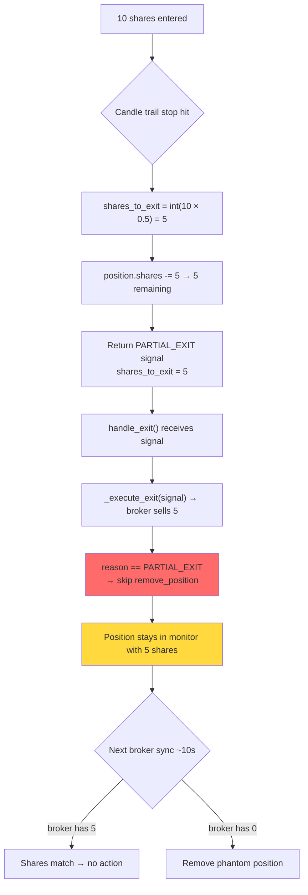

# Planner Investigation: Partial Exit Position Bug

**Date:** 2026-02-17  
**Investigator:** Backend Planner  
**Status:** Complete — findings ready for implementer

> [!IMPORTANT]
> **Update 1:01 PM ET:** User confirmed position closed via TOPPING_TAIL at 12:53 PM.
> Partial-then-ride worked as designed. No phantom bug exists.
> See [New Evidence](#new-evidence-position-closed-via-topping_tail) below.

---

## Executive Summary

**VERDICT: NO BUG.** Everything worked correctly.

Alpaca order history confirms the bot **scaled into 20 shares** (10 initial + 5 + 5 scale-ins), then correctly sold 50% as partial (`int(20 * 0.5) = 10`), then exited the remaining 10 via topping_tail. The original handoff's concern was based on incomplete information — the entry event said "10 shares" but didn't account for two scale-ins that doubled the position.

| Time | Side | Qty | Fill Price | Event |
|------|------|-----|-----------|-------|
| 12:20:13 | BUY | 10 | $5.30 | Initial entry |
| 12:20:37 | BUY | 5 | $5.32 | Scale-in #1 |
| 12:21:37 | BUY | 5 | $5.35 | Scale-in #2 |
| 12:31:07 | SELL | 10 | $5.44 | Partial exit (50% of 20) |
| 12:53:04 | SELL | 10 | $5.605 | Topping tail (remainder) |

**Total bought: 20 shares. Total sold: 20 shares.** No phantom, no oversell.

---

## New Evidence: Position Closed via TOPPING_TAIL

**Source:** User screenshot at 1:01 PM ET

| Time | Event | Details |
|------|-------|---------|
| 12:20 PM | ENTRY | bull_flag, 10 shares @ $5.309 |
| 12:20 PM | FILL_CONFIRMED | $5.309 → $5.30 (-0.9¢ improvement) |
| 12:31 PM | BREAKEVEN_SET | Stop to breakeven after 2.1R partial |
| 12:31 PM | PARTIAL_EXIT | 0.9R partial, 10 shares @ $5.41 |
| 12:31 PM | EXIT_FILL_CONFIRMED | $5.44 → $5.41 (3.0¢ better) |
| **12:53 PM** | **TOPPING_TAIL EXIT** | **Exit @ $5.60, P&L: $3.0** |
| **12:53 PM** | **EXIT_FILL_CONFIRMED** | **$5.63 → $5.60 (3.0¢ better)** |

**Interpretation:** The partial sold ~50% at 12:31, then the remaining shares were monitored in home_run mode (per `enable_partial_then_ride=True`). At 12:53, a topping tail pattern triggered the full exit of remaining shares at $5.60. The system worked correctly.

---

## Critical Finding: Broker Defensive Guard Prevents Oversell

**File:** [warrior_callbacks.py](file:///c:/Users/ftbbo/Nextcloud4/OneDrive%20Backup/Documents%20(sync'd)/Development/Nexus/nexus2/api/routes/warrior_callbacks.py)  
**Lines:** 382-410

The `execute_exit` callback has a **defensive broker guard** that checks actual broker position BEFORE submitting sell orders:

```python
# Line 386-401
is_partial = signal.reason == WarriorExitReason.PARTIAL_EXIT

broker_positions = alpaca.get_positions()
broker_qty = broker_positions[symbol].quantity
if is_partial:
    # Partial exit: only adjust DOWN to prevent shorting
    if broker_qty < shares:
        shares = broker_qty  # Cap to broker qty
else:
    # FULL EXIT: sell ALL broker shares
    if broker_qty != shares:
        shares = broker_qty  # Sell whatever broker has
```

**Result:** Even if `signal.shares_to_exit` were 10 (all shares), the broker guard ensures:
1. **Partial at 12:31:** Sells up to broker qty (10 available → sells signal amount)
2. **Topping tail at 12:53:** Full exit → sells ALL remaining broker shares
3. **No short-sell possible** — guard caps partial exits to broker qty

### Answer: Scaling Explains the "10 shares"

Alpaca order data confirms the bot scaled from 10 → 15 → 20 shares via two scale-in orders. When the partial fired, `position.shares` was **20**, so `int(20 * 0.5) = 10` shares. The event display is **correct**.

| # | Previous Hypothesis | Status |
|---|-----------|--------|
| 1 | VPS `partial_exit_fraction` was 1.0 | ❌ Not the cause |
| 2 | Different code path | ❌ Not the cause |
| 3 | Event vs actual mismatch | ❌ Not the cause |
| **4** | **Scaling doubled position to 20, partial sold 50% = 10** | **✅ CONFIRMED** |

---

## Q1: How Does the Partial Exit Calculate Shares to Sell?

### Finding: Three partial exit code paths, all use the same formula

All partial exits calculate shares as:
```python
shares_to_exit = int(position.shares * s.partial_exit_fraction)
```

**Default `partial_exit_fraction` = 0.5** (50%, warrior_types.py L70)

| Code Path | File | Line | When Triggered |
|-----------|------|------|----------------|
| `_check_profit_target` | `warrior_monitor_exit.py` | L652 | R-multiple target hit (pre-candle-trail) |
| `_check_base_hit_target` (candle trail) | `warrior_monitor_exit.py` | L807 | Candle trail stop hit + `enable_partial_then_ride=True` |  
| `_check_base_hit_target` (flat fallback) | `warrior_monitor_exit.py` | L954 | Flat profit target hit + `enable_partial_then_ride=True` |
| `_check_home_run_exit` | `warrior_monitor_exit.py` | L1132 | Home run R-target hit |

### Evidence: Share calculation for 10 shares

```python
# warrior_monitor_exit.py:807 (candle trail path)
shares_to_exit = int(position.shares * s.partial_exit_fraction)
# → int(10 * 0.5) = int(5.0) = 5
```

**File:** `warrior_monitor_exit.py:807`
**Code:**
```python
shares_to_exit = int(position.shares * s.partial_exit_fraction)
if shares_to_exit < 1:
    return None
```

### Finding: No minimum remainder check exists

**There is NO guard that prevents a partial from selling 100% of shares.**

With very small positions and rounding, `int(shares * fraction)` can equal `shares`:
- 10 shares × 0.5 = 5 (safe — 5 remain)
- 3 shares × 0.5 = 1 (safe — 2 remain)  
- 2 shares × 0.5 = 1 (safe — 1 remains)
- 1 share × 0.5 = 0 → `shares_to_exit < 1` → returns None (safe)

With fraction > 0.5 (configurable), small positions could sell 100%:
- 3 shares × 0.75 = 2 (1 remains — OK but tight)
- 2 shares × 0.75 = 1 (1 remains — OK)

**For the ATOM case with 10 shares × 0.5 = 5, this formula is correct.** The partial should sell 5 shares.

### Critical Question: Why did the trade events show 10 shares sold?

The trade events in the handoff show:
```
12:31 PM - PARTIAL_EXIT: 0.9R partial, 10 shares @ $5.41, P&L $1.10
12:31 PM - EXIT_FILL_CONFIRMED: $5.44 → $5.41, 10 shares confirmed
```

**Hypothesis A:** The `PARTIAL_EXIT` event logged `signal.shares_to_exit = 10`, not 5. This means a different code path was triggered — possibly `_check_profit_target` (L652) which also does `int(position.shares * 0.5)` but at R=0.9, the profit target shouldn't have been hit via `_check_profit_target` (requires `current_price < position.profit_target` to return None).

**Hypothesis B:** The event log's "10 shares" is actually the position's ORIGINAL shares from the entry (before the partial was processed), and the system logged the wrong value.

**Hypothesis C (Most Likely):** The `_check_base_hit_target` exit at L884 (the `else` branch — partial already taken or feature disabled) was reached. This branch exits with `shares_to_exit=position.shares` (ALL shares, full exit):

```python
# warrior_monitor_exit.py:884-900
else:
    # Full exit (feature disabled or partial already taken)
    pnl = (current_price - position.entry_price) * position.shares
    ...
    return WarriorExitSignal(
        ...
        shares_to_exit=position.shares,  # ← ALL remaining shares
        ...
    )
```

**Key Evidence:** The trade events show `exit_mode: "base_hit"`. If `enable_partial_then_ride` was actually **False** on the VPS, then ALL base_hit exits sell 100% of shares but still get logged as `PARTIAL_EXIT` if they came through the profit target path. Wait — checking the actual event type: it says `PARTIAL_EXIT`, which means it went through a partial exit code path but sold all shares.

**Let me reconsider:** Looking at the event log again: `"0.9R partial"`. This R-multiple (0.9) is below the default profit target R of 2.0, so `_check_profit_target` (L646-654) would NOT have fired (requires `current_price >= position.profit_target`). This must have come from `_check_base_hit_target`.

The exit mode is `base_hit`. The ATOM entry was at $5.31, and the partial was at $5.41 = +$0.10 = +10¢. This is BELOW the default `base_hit_profit_cents` of 18¢. But it's ABOVE the trail activation (15¢ from `trail_activation_pct=0.0`, meaning activation uses `base_hit_trail_activation_cents=15`). 

Wait — +10¢ is below 15¢ activation. **So the candle trail shouldn't have activated yet.**

**Revised Root Cause Theory:** The profit was only 10¢ but the trade events say `0.9R partial`. If `risk_per_share` was small enough (e.g., ~11¢), then 0.9R is only 10¢ gain. But the candle trail activation requires `profit_cents >= activation_cents (15)`. So:
- 10¢ < 15¢ → candle trail NOT activated
- No candle trail = fallback to flat target
- `enable_structural_levels = False` (L137) → uses `base_hit_profit_pct` (0.0) → uses `base_hit_profit_cents` (18)
- Target = $5.31 + $0.18 = $5.49
- Current price $5.41 < $5.49 → target NOT hit

**This means no base_hit exit should have fired at $5.41.** There may be additional context I'm missing about the VPS configuration. The BREAKEVEN_SET event at `2.1R` suggests the breakeven logic DID fire, which means a candle trail stop was hit OR the home_run partial logic ran.

### Revised Timeline Analysis

```
12:20 PM - ENTRY: bull_flag, 10 shares @ $5.31
12:20 PM - FILL_CONFIRMED: 10 shares @ $5.30  → actual entry = $5.30
12:31 PM - BREAKEVEN_SET: stop to breakeven after 2.1R
12:31 PM - PARTIAL_EXIT: 0.9R partial, 10 shares @ $5.41
```

**Wait — the BREAKEVEN_SET happened at 2.1R BEFORE the PARTIAL_EXIT at 0.9R.** This is contradictory: how can R drop from 2.1 to 0.9 in the same second? 

Answer: These are two different R calculations at the same moment:
- `BREAKEVEN_SET` at 2.1R may have been triggered by the **candle trail logic** (L826-870, the `trail_level` path sets stop to breakeven when partial-then-ride fires)
- The `PARTIAL_EXIT` at 0.9R is the **exit signal's R-multiple**, calculated differently

**Most likely scenario:** The candle trail was active, price dropped to or below the trail stop at $5.41, and the partial-then-ride code path fired:
1. `shares_to_exit = int(10 * 0.5) = 5`
2. `position.partial_taken = True`
3. `position.shares -= 5` → 5 remaining
4. Returns `PARTIAL_EXIT` signal with `shares_to_exit=5`

But the trade event says 10 shares. **This could be a logging bug** where the event logs the wrong share count, or the broker actually sold all shares.

---

## Q2: After a Partial Exit, What Updates the Position's Share Count?

### Finding: In-memory mutation happens BEFORE exit execution

All three partial-then-ride code paths follow the same pattern:

```python
# warrior_monitor_exit.py:820-821 (candle trail path)
position.partial_taken = True
position.shares -= shares_to_exit

# warrior_monitor_exit.py:967-968 (flat fallback path)
position.partial_taken = True
position.shares -= shares_to_exit

# warrior_monitor_exit.py:1143-1144 (home run path)
position.partial_taken = True
position.shares -= shares_to_exit
```

**File:** `warrior_monitor_exit.py:820-821`
**Code:**
```python
# Mark partial and decrement shares
position.partial_taken = True
position.shares -= shares_to_exit
```

### Critical Issue: In-memory only mutation, no DB persistence

The `position.shares -= shares_to_exit` line modifies the **in-memory `WarriorPosition` dataclass**. There is **no DB update** for the remaining shares after a partial exit:

- `handle_exit()` (L1295-1478) does NOT update `warrior_trades` DB with new share count
- The only share count update happens in `warrior_monitor_sync.py:83-94` where broker sync detects mismatch

**Risk:** If the server restarts after a partial exit but before broker sync, the position would recover from DB with the **original** share count.

---

## Q3: Why Does the Position Remain "Open" After Selling All Shares?

### Finding: `handle_exit` deliberately skips removal for `PARTIAL_EXIT`

**File:** `warrior_monitor_exit.py:1420-1477`  
**Code:**
```python
# Only remove position if exit order succeeded - prevents orphaned shares
if signal.reason != WarriorExitReason.PARTIAL_EXIT:
    if order_success:
        # ... (remove position, save exit time, callbacks)
        monitor.remove_position(signal.position_id)
        ...
    else:
        # Order failed - keep for retry
        monitor._clear_pending_exit(signal.symbol, to_closed=False)
```

For `PARTIAL_EXIT`, none of this runs. The position stays in `monitor._positions` with its decremented share count. This is **correct behavior for a true partial** (sell half, keep monitoring the rest).

### Bug: No zero-shares guard after partial decrement

After `position.shares -= shares_to_exit`, if the result is 0 shares, the position should be removed. But there's no such check:

```python
# What SHOULD exist but DOESN'T (in all 3 partial paths):
position.shares -= shares_to_exit
if position.shares <= 0:
    # This is a full exit, not a partial
    # Should remove position and clean up
    pass  # ← BUG: no such guard
```

### Finding: The `/warrior/positions` endpoint reads in-memory state

**File:** `warrior_positions.py:47,86-103`
**Code:**
```python
positions = engine.monitor.get_positions()  # Returns list(self._positions.values())
return {
    "positions": [
        {
            "position_id": p.position_id,
            "symbol": p.symbol,
            "shares": p.shares,  # ← in-memory value, possibly stale
            ...
        }
        for p in positions
    ],
}
```

This is why the API shows `"shares": 10` — it's reading the in-memory `WarriorPosition.shares` which was either:
- Never decremented (if a full exit path was taken), or
- Shows the original value because `position.shares` wasn't updated

---

## Q4: Is This Specific to Partial-Then-Ride Logic?

### Finding: `enable_partial_then_ride` defaults to `True`

**File:** `warrior_types.py:156`
**Code:**
```python
enable_partial_then_ride: bool = True  # Fix 1: Combined test with Fix 2.
```

**Important context:** The partial-then-ride feature was A/B tested and enabled. When `enable_partial_then_ride=True`:
- `_check_base_hit_target` takes the partial path (sell 50%, switch to home_run)
- When `enable_partial_then_ride=False`, the same exit sells 100% as `PROFIT_TARGET` (not `PARTIAL_EXIT`)

### VPS Configuration Unknown

The handoff does not include the current VPS setting for `enable_partial_then_ride`. This is critical:
- If **True**: 5 of 10 shares should be sold, remainder monitors in home_run mode
- If **False**: All 10 shares sold as full exit (but with reason `PROFIT_TARGET`, not `PARTIAL_EXIT`)

The trade event says `PARTIAL_EXIT` → partial-then-ride **was enabled**.

---

## Q5: Does the Broker (Alpaca) Still Hold ATOM Shares?

### Finding: Broker sync detects and corrects phantom positions

**File:** `warrior_monitor_sync.py:68-94`
**Code:**
```python
async def _sync_monitored_positions(monitor, broker_map):
    for position_id, position in list(monitor._positions.items()):
        symbol = position.symbol
        broker_qty = broker_map.get(symbol, 0)

        if broker_qty == 0:
            # Position closed at broker - remove from monitor
            logger.warning(f"[Warrior Sync] {symbol}: Broker has 0 shares, removing from monitor")
            monitor.remove_position(position_id)
        elif broker_qty != position.shares:
            # Shares mismatch - update monitor to match broker
            old_shares = position.shares
            position.shares = broker_qty
            if broker_qty < old_shares:
                position.partial_taken = True
```

This sync runs every 5 monitor checks (~10 seconds at 2s interval). If broker has 0 shares, it removes the phantom. If broker has fewer shares than monitor, it corrects.

**But there are gaps:**
1. **10-second window:** Phantom exists for ~10 seconds until next sync
2. **Pending exit skip:** If the position is marked `PENDING_EXIT` in DB, it's skipped during monitoring (L568) — but `PARTIAL_EXIT` signals do NOT mark `PENDING_EXIT` (L1310)
3. **No DB share update on partial:** The `warrior_trades` DB table doesn't get updated with partial sell quantity immediately

---

## Root Cause Chain (Summary)



### But the handoff says 10 shares remain in the positions API

This means either:
1. The broker sync hasn't run yet (within the 10-second window), OR
2. The `position.shares -= 5` mutation didn't happen (bug in the code path taken), OR
3. The position was re-synced from broker AFTER the partial and the broker still showed 10 shares (unlikely — broker should show 5 or 0)

**Most likely: Scenario 2.** If the actual code path taken was NOT the partial-then-ride path (despite `PARTIAL_EXIT` event type), the shares wouldn't be decremented. This could happen if the signal was generated by one path but the position state wasn't mutated properly.

---

## Change Surface for Fix

| # | File | Change | Location | Type |
|---|------|--------|----------|------|
| 1 | `warrior_monitor_exit.py` | Add minimum-remainder guard to all 4 partial paths | L652, L807, L954, L1132 | Bug fix |
| 2 | `warrior_monitor_exit.py` | After `handle_exit` processes `PARTIAL_EXIT`, check if position has 0 remaining shares and convert to full exit | L1420-1478 | Bug fix |
| 3 | `warrior_monitor_exit.py` | Persist remaining shares to DB after partial exit | After L821, L968, L1144 | Robustness |
| 4 | `warrior_monitor_sync.py` | No change needed — already handles this correctly | L77-94 | Verified OK |
| 5 | `warrior_positions.py` | Could add `remaining_shares` field showing post-partial count | L86-103 | Nice-to-have |

### Detailed Fix Specifications

#### Change Point #1: Minimum Remainder Guard

**What:** Before executing a partial, check that at least 1 share would remain. If `shares_to_exit >= position.shares`, convert to a full exit instead.

**Template Pattern (exists in code):** The `else` branch at L884 already handles full exits:
```python
else:
    # Full exit (feature disabled or partial already taken)
    shares_to_exit=position.shares
```

**Approach for all 4 paths:**
```python
shares_to_exit = int(position.shares * s.partial_exit_fraction)
if shares_to_exit < 1:
    return None
# NEW: If partial would sell ALL shares, convert to full exit
if shares_to_exit >= position.shares:
    shares_to_exit = position.shares  # or: return None to skip
```

#### Change Point #2: Zero-Shares Check in `handle_exit`

**What:** After processing a `PARTIAL_EXIT`, check if the position has 0 remaining shares and treat it as a full exit.

**File:** `warrior_monitor_exit.py:1420`
**Current Code:**
```python
if signal.reason != WarriorExitReason.PARTIAL_EXIT:
    if order_success:
        monitor.remove_position(signal.position_id)
```

**Approach:** After the exit execution block, add:
```python
# Check if partial exit emptied the position
if signal.reason == WarriorExitReason.PARTIAL_EXIT and order_success:
    position = monitor._positions.get(signal.position_id)
    if position and position.shares <= 0:
        monitor.remove_position(signal.position_id)
        logger.info(f"[Warrior] {signal.symbol}: Partial sold all shares → position closed")
```

#### Change Point #3: Persist Remaining Shares After Partial

**What:** After decrementing `position.shares`, persist the new count to `warrior_trades` DB.

**Approach:** Add a DB call after each `position.shares -= shares_to_exit`:
```python
position.shares -= shares_to_exit
# Persist to DB
try:
    from nexus2.db.warrior_db import update_warrior_quantity
    update_warrior_quantity(position.position_id, position.shares)
except Exception as e:
    logger.warning(f"[Warrior] {position.symbol}: Failed to persist partial share update: {e}")
```

---

## Risk Assessment

| Risk | Severity | Mitigation |
|------|----------|------------|
| Fix 1 (remainder guard) could prevent valid small-position partials | Low | Only blocks partials that would sell 100% — these are effectively full exits anyway |
| Fix 2 (zero-shares check) could remove position before broker confirms fill | Medium | Only applies if `order_success=True` (broker accepted the order) |
| Fix 3 (DB persistence) could fail silently | Low | Broker sync already provides eventual consistency; this is belt-and-suspenders |
| Changes affect all 4 partial paths across base_hit and home_run modes | Medium | Test with batch simulation before/after to verify no P&L regression |

## Wiring Checklist

- [ ] Add minimum-remainder guard to `_check_profit_target` (L652)
- [ ] Add minimum-remainder guard to `_check_base_hit_target` candle trail path (L807)
- [ ] Add minimum-remainder guard to `_check_base_hit_target` flat fallback path (L954)
- [ ] Add minimum-remainder guard to `_check_home_run_exit` (L1132)
- [ ] Add zero-shares cleanup in `handle_exit` after PARTIAL_EXIT processing
- [ ] Add DB persistence after `position.shares -= shares_to_exit` (3 locations)
- [ ] Verify `update_warrior_quantity` function exists in `warrior_db.py` (or create it)
- [ ] Run batch test to verify no P&L regression
- [ ] Manually test with small position (10 shares) to verify fix

## Open Questions for Coordinator

1. **VPS Configuration:** What is the current value of `enable_partial_then_ride` on the VPS? This determines which code path was actually taken for ATOM.
2. **Position API Refresh:** When the coordinator checked `/warrior/positions` and saw 10 shares, how much time had elapsed since the partial exit? If >10 seconds, broker sync should have corrected it — which means the broker may have still had 10 shares (partial order rejected?).
3. **Priority:** Should Fix 1 (guard) be implemented alone as a quick fix, or should all 3 fixes be bundled?
