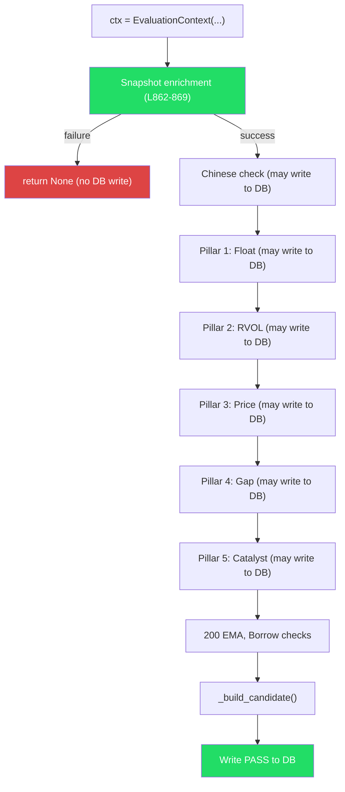

# Spec: EvaluationContext None Defaults (Option B)

**Date:** 2026-02-19  
**Author:** Backend Planner  
**Scope:** `warrior_scanner_service.py` — `EvaluationContext` dataclass  
**Risk Level:** Low — changes are isolated to field defaults with existing `None` guards  

---

## Goal

Change 7 `EvaluationContext` field defaults from `0` / `Decimal("0")` to `None`. This fixes the root cause of zero metrics in the Warrior Scans tab by representing "not yet enriched" as `None` rather than a misleading `0`.

---

## Change Set

### File: [warrior_scanner_service.py](file:///c:/Users/ftbbo/Nextcloud4/OneDrive%20Backup/Documents%20%28sync%27d%29/Development/Nexus/nexus2/domain/scanner/warrior_scanner_service.py)

#### Change 1: Session Snapshot Fields (Lines 433-438)

```diff
 # Session snapshot data
-session_volume: int = 0
-avg_volume: int = 0
-session_high: Decimal = Decimal("0")
-session_low: Decimal = Decimal("0")
+session_volume: Optional[int] = None
+avg_volume: Optional[int] = None
+session_high: Optional[Decimal] = None
+session_low: Optional[Decimal] = None
 session_open: Optional[Decimal] = None
-last_price: Decimal = Decimal("0")
+last_price: Optional[Decimal] = None
 yesterday_close: Optional[Decimal] = None
```

#### Change 2: RVOL Field (Line 446)

```diff
 # RVOL data
-rvol: Decimal = Decimal("0")
+rvol: Optional[Decimal] = None
 is_ideal_rvol: bool = False
```

#### Change 3: Gap Field (Line 457)

```diff
 # Gap data
-gap_pct: Decimal = Decimal("0")
+gap_pct: Optional[Decimal] = None
 opening_gap_pct: Optional[float] = None
 live_gap_pct: Optional[float] = None
```

**Total: 7 field defaults changed. No other code changes required.**

---

## Safety Analysis: Why No Other Code Changes Are Needed

### Execution Flow Guarantees

The `_evaluate_symbol` method (L820-1072) enforces a strict execution order:



> [!IMPORTANT]
> If snapshot fails (L852), the method returns `None` at L860 **without any DB write**. This means `session_volume`, `avg_volume`, `session_high`, `session_low`, and `last_price` are **always enriched** before any code reads them.

### Field-by-Field Reference Audit

#### `ctx.rvol` — 16 references

| Line | Code | Category | Safe? | Reasoning |
|------|------|----------|-------|-----------|
| 446 | `rvol: Decimal = Decimal("0")` | **Definition** | — | → Changing to `Optional[Decimal] = None` |
| 565 | `float(ctx.rvol) if ctx and ctx.rvol is not None else None` | DB write | ✅ | Already has `is not None` guard |
| 941 | `RVOL:{ctx.rvol:.1f}x` | Logging | ✅ | Runs in catalyst block (after Pillar 2) |
| 1058 | `RVOL: {ctx.rvol:.1f}x` | Logging | ✅ | Runs only for PASS (all pillars done) |
| 1271 | `ctx.rvol = projected / Decimal(avg)` | Enrichment write | ✅ | Sets the value |
| 1281 | `ctx.rvol = projected / Decimal(avg)` | Enrichment write | ✅ | Sets the value |
| 1283 | `ctx.rvol = Decimal("0")` | Explicit set | ✅ | Sets to 0 when avg_volume=0 (intentional) |
| 1285 | `if ctx.rvol < s.min_rvol:` | Comparison | ✅ | After enrichment (L1271/1281/1283) |
| 1290 | `round(float(ctx.rvol), 2)` | Dict value | ✅ | After enrichment |
| 1293 | `RVOL:{ctx.rvol:.1f}x` | Logging | ✅ | After enrichment |
| 1295 | `RVOL: {ctx.rvol:.1f}x` | Logging | ✅ | After enrichment |
| 1298 | `RVOL {ctx.rvol:.1f}x` | Logging | ✅ | After enrichment |
| 1302 | `ctx.rvol >= s.ideal_rvol` | Comparison | ✅ | After enrichment |
| 1372 | `ctx.rvol >= s.momentum_override_rvol` | Comparison | ✅ | In catalyst pillar (after Pillar 2) |
| 1378 | `RVOL:{ctx.rvol:.0f}x` | Logging | ✅ | In catalyst pillar (after Pillar 2) |
| 1391 | `RVOL:{ctx.rvol:.1f}x` | Logging | ✅ | In catalyst pillar (after Pillar 2) |
| 1685 | `RVOL:{ctx.rvol:.1f}x` | Logging | ✅ | In 200 EMA check (after Pillar 2) |
| 1788 | `relative_volume=ctx.rvol` | Build candidate | ✅ | Only for PASS (all pillars done) |

#### `ctx.gap_pct` — 9 references

| Line | Code | Category | Safe? | Reasoning |
|------|------|----------|-------|-----------|
| 457 | `gap_pct: Decimal = Decimal("0")` | **Definition** | — | → Changing to `Optional[Decimal] = None` |
| 564 | `float(ctx.gap_pct) if ctx and ctx.gap_pct is not None else None` | DB write | ✅ | Already has `is not None` guard |
| 1609 | `ctx.gap_pct = Decimal(str(max(...)))` | Enrichment write | ✅ | Sets the value |
| 1611 | `if ctx.gap_pct < s.min_gap:` | Comparison | ✅ | After enrichment (L1609) |
| 1632 | `round(float(ctx.gap_pct), 1)` | Dict value | ✅ | After enrichment |
| 1635 | `Gap {ctx.gap_pct:.1f}%` | Logging | ✅ | After enrichment |
| 1639 | `ctx.gap_pct >= s.ideal_gap` | Comparison | ✅ | After enrichment |
| 1685 | `Gap:{ctx.gap_pct:.1f}%` | Logging | ✅ | In 200 EMA check (after Pillar 4) |
| 1793 | `Decimal(str(ctx.gap_pct))` | Build candidate | ✅ | Only for PASS |

#### `ctx.last_price` — 8 references

| Line | Code | Category | Safe? | Reasoning |
|------|------|----------|-------|-----------|
| 438 | `last_price: Decimal = Decimal("0")` | **Definition** | — | → Changing to `Optional[Decimal] = None` |
| 571 | `float(ctx.last_price) if ctx and ctx.last_price is not None else None` | DB write | ✅ | Already has `is not None` guard |
| 868 | `ctx.last_price = Decimal(str(snapshot["last_price"]))` | Enrichment write | ✅ | Snapshot enrichment (always before reads) |
| 1603 | `ctx.last_price - ctx.yesterday_close` | Arithmetic | ✅ | In gap pillar (after snapshot) |
| 1667 | `float(ctx.last_price) > 0` | Guard condition | ✅ | In 200 EMA (after snapshot) |
| 1668 | `float(ctx.last_price) - float(ctx.ema_200_value)` | Arithmetic | ✅ | Inside L1667 guard |
| 1678 | `round(float(ctx.last_price), 2)` | Dict value | ✅ | Inside L1667 guard |
| 1686 | `Price: ${ctx.last_price:.2f}` | Logging | ✅ | In 200 EMA (after snapshot) |
| 1792 | `Decimal(str(ctx.last_price))` | Build candidate | ✅ | Only for PASS |

#### `ctx.session_high` — 2 references

| Line | Code | Category | Safe? | Reasoning |
|------|------|----------|-------|-----------|
| 435 | `session_high: Decimal = Decimal("0")` | **Definition** | — | → Changing to `Optional[Decimal] = None` |
| 865 | `ctx.session_high = Decimal(str(snapshot["session_high"]))` | Enrichment write | ✅ | Snapshot enrichment |
| 1803 | `Decimal(str(ctx.session_high))` | Build candidate | ✅ | Only for PASS (after snapshot) |

#### `ctx.session_low` — 2 references

| Line | Code | Category | Safe? | Reasoning |
|------|------|----------|-------|-----------|
| 436 | `session_low: Decimal = Decimal("0")` | **Definition** | — | → Changing to `Optional[Decimal] = None` |
| 866 | `ctx.session_low = Decimal(str(snapshot["session_low"]))` | Enrichment write | ✅ | Snapshot enrichment |
| 1804 | `Decimal(str(ctx.session_low))` | Build candidate | ✅ | Only for PASS (after snapshot) |

#### `ctx.session_volume` — 4 references

| Line | Code | Category | Safe? | Reasoning |
|------|------|----------|-------|-----------|
| 433 | `session_volume: int = 0` | **Definition** | — | → Changing to `Optional[int] = None` |
| 863 | `ctx.session_volume = snapshot["session_volume"]` | Enrichment write | ✅ | Snapshot enrichment |
| 1270 | `Decimal(ctx.session_volume) * ...` | Arithmetic | ✅ | In RVOL pillar (after snapshot) |
| 1278 | `Decimal(ctx.session_volume) * ...` | Arithmetic | ✅ | In RVOL pillar (after snapshot) |
| 1805 | `session_volume=ctx.session_volume` | Build candidate | ✅ | Only for PASS |

#### `ctx.avg_volume` — 4 references

| Line | Code | Category | Safe? | Reasoning |
|------|------|----------|-------|-----------|
| 434 | `avg_volume: int = 0` | **Definition** | — | → Changing to `Optional[int] = None` |
| 864 | `ctx.avg_volume = snapshot["avg_daily_volume"]` | Enrichment write | ✅ | Snapshot enrichment |
| 1257 | `if ctx.avg_volume > 0:` | Comparison | ✅ | In RVOL pillar (after snapshot) |
| 1271 | `Decimal(ctx.avg_volume)` | Arithmetic | ✅ | Inside L1257 guard (avg_volume > 0) |
| 1281 | `Decimal(ctx.avg_volume)` | Arithmetic | ✅ | Inside L1257 guard |
| 1806 | `avg_volume=ctx.avg_volume` | Build candidate | ✅ | Only for PASS |

---

### DB Write Method Analysis

The `_write_scan_result_to_db` method ([L559-577](file:///c:/Users/ftbbo/Nextcloud4/OneDrive%20Backup/Documents%20%28sync%27d%29/Development/Nexus/nexus2/domain/scanner/warrior_scanner_service.py#L559-L577)) already guards the 3 fields it writes to DB:

```python
gap_pct=float(ctx.gap_pct) if ctx and ctx.gap_pct is not None else None,  # ✅
rvol=float(ctx.rvol) if ctx and ctx.rvol is not None else None,            # ✅
price=float(ctx.last_price) if ctx and ctx.last_price is not None else None, # ✅
```

With None defaults, these guards now correctly write `NULL` for un-enriched fields instead of `0.0`.

`session_volume`, `avg_volume`, `session_high`, `session_low` are **not written to the DB** by this method — they're only used in `_build_candidate` which runs exclusively for PASS results.

---

## Test File Impact

### [test_warrior_scanner_pillars.py](file:///c:/Users/ftbbo/Nextcloud4/OneDrive%20Backup/Documents%20%28sync%27d%29/Development/Nexus/nexus2/tests/unit/scanners/test_warrior_scanner_pillars.py) — ✅ NO CHANGES NEEDED

The `make_ctx()` helper (L55-73) **explicitly sets all affected fields**:
```python
session_volume=500_000,      # explicit
avg_volume=100_000,          # explicit
session_high=Decimal("11.00"),  # explicit
session_low=Decimal("9.50"),    # explicit
last_price=Decimal("10.50"),    # explicit
```

`rvol` and `gap_pct` are not set (they use defaults), but test methods call the pillar methods that enrich them. No issues.

### [test_warrior_scanner.py](file:///c:/Users/ftbbo/Nextcloud4/OneDrive%20Backup/Documents%20%28sync%27d%29/Development/Nexus/nexus2/tests/unit/scanners/test_warrior_scanner.py) — ✅ NO CHANGES NEEDED

The `base_context` fixture (L180-195) **explicitly sets `rvol`**:
```python
rvol=Decimal("60"),  # explicit
```

Other affected fields use defaults but are never read in these tests (the tests check momentum override behavior using `ctx.rvol` and `ctx.change_percent` only).

### [test_scanner_validation.py](file:///c:/Users/ftbbo/Nextcloud4/OneDrive%20Backup/Documents%20%28sync%27d%29/Development/Nexus/nexus2/tests/test_scanner_validation.py) — ✅ NO CHANGES NEEDED

`EvaluationContext` constructions at L310, L343, L374, L401, L417, L433, L452 **explicitly set the fields they need**:

- **Gap tests** (L343): Set `session_open`, `last_price`, `yesterday_close` explicitly
- **Price tests** (L310): Only use `price` (not affected)
- **Float tests** (L374): Don't read affected fields
- **Full scan** (L474): Uses `_evaluate_symbol()` with snapshot mocks that enrich all fields

---

## Verification Plan

### Automated Tests

1. **Run existing scanner tests** to confirm no regressions:
```powershell
cd "c:\Users\ftbbo\Nextcloud4\OneDrive Backup\Documents (sync'd)\Development\Nexus"
python -m pytest nexus2/tests/unit/scanners/test_warrior_scanner_pillars.py -v
python -m pytest nexus2/tests/unit/scanners/test_warrior_scanner.py -v
python -m pytest nexus2/tests/test_scanner_validation.py -v
```

2. **Run full test suite** to confirm no broader regressions:
```powershell
python -m pytest nexus2/tests/ -v --tb=short
```

### Manual Verification

After deploying to VPS:
- Run a Warrior scan and verify that early-rejected symbols show `NULL` for `rvol`, `gap_pct`, `price` in the DB instead of `0.0`
- Query the telemetry DB to confirm:
```sql
SELECT symbol, result, gap_pct, rvol, price, reason
FROM warrior_scan_results
WHERE reason IS NOT NULL
ORDER BY timestamp DESC
LIMIT 20;
```
- Confirm PASS results still have real values (not NULL)

---

## Summary

| Aspect | Detail |
|--------|--------|
| **Files changed** | 1 (`warrior_scanner_service.py`) |
| **Lines changed** | 7 (field defaults only) |
| **Test files changed** | 0 |
| **New tests needed** | 0 (existing tests cover all pillar paths) |
| **Risk** | Low — execution flow guarantees prevent None from reaching arithmetic |
| **Rollback** | Trivial — revert 7 field defaults |
