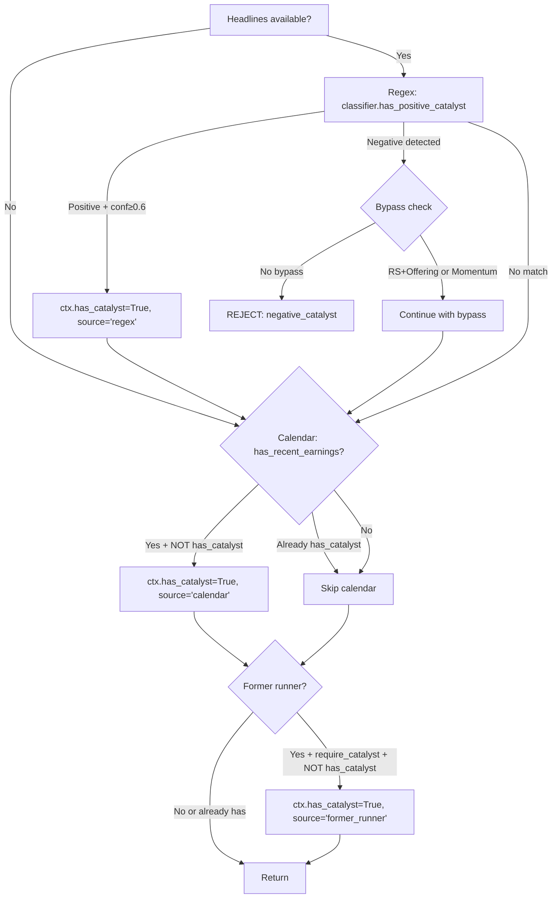
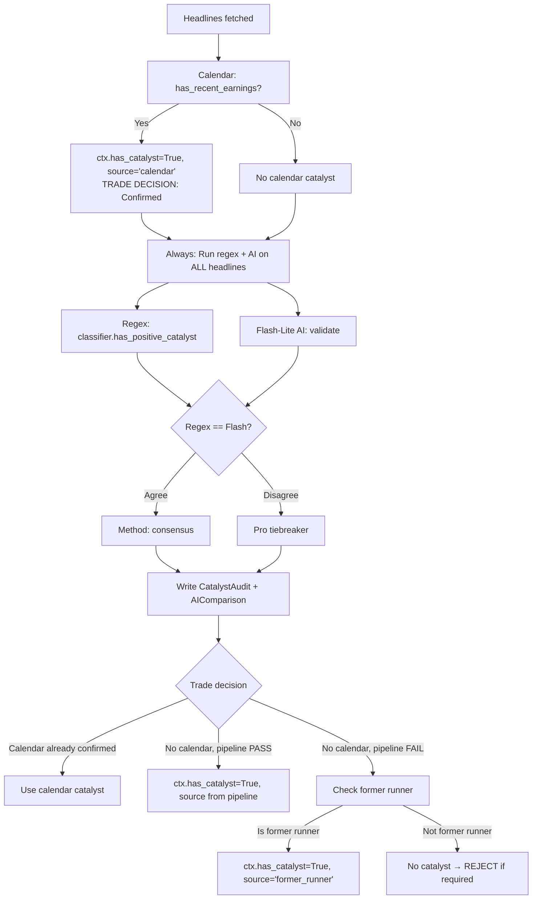

# Catalyst Pipeline Refactoring — Technical Specification

> **Author:** Backend Planner Agent  
> **Date:** 2026-02-20  
> **Status:** Draft — awaiting Clay's review  

---

## 1. Executive Summary

The current catalyst pipeline short-circuits AI validation when regex matches, preventing comparison data generation. Clay's intended design runs regex and AI **in parallel on ALL headlines**, with Pro as a tiebreaker when they disagree. Calendar-resolved catalysts (earnings date + gap) should confirm the trade decision early but **still run the full pipeline for data collection**.

This spec maps the current implementation, identifies all change points, and proposes a new flow.

---

## 2. Current Pipeline Flow

### 2.1 Call Sequence in `_evaluate_symbol` (L870-951)

```
L920  headlines = get_merged_headlines(symbol)
L926  _evaluate_catalyst_pillar(ctx, tracker, headlines)    ← regex + calendar + former runner
L930  _run_multi_model_catalyst_validation(ctx, headlines)  ← AI (gated by NOT ctx.has_catalyst)
L933  _run_legacy_ai_fallback(ctx, headlines)               ← legacy AI (gated by NOT ctx.has_catalyst)
L936  if require_catalyst and not ctx.has_catalyst → REJECT
```

### 2.2 `_evaluate_catalyst_pillar` (L1307-1426)



**Key problem:** Once `ctx.has_catalyst = True` (e.g., from regex at L1335), all downstream checks are skipped:
- Calendar at L1404: `if not ctx.has_catalyst`
- Former runner at L1418: `if ... not ctx.has_catalyst`

### 2.3 `_run_multi_model_catalyst_validation` (L1428-1521)

**Entry gate (L1436-1437):**
```python
if not headlines or not s.enable_multi_model_comparison:
    return
```

**Cache check (L1442-1453):** If HeadlineCache has a valid catalyst → set `ctx.has_catalyst`, return early.

**AI run gate (L1458):**
```python
if new_headlines and not ctx.has_catalyst:      # ← THE GATE
    multi_validator = get_multi_validator()
```

**Finding:** `not ctx.has_catalyst` at L1458 is the root cause. If regex or calendar already set `ctx.has_catalyst = True`, the entire multi-model pipeline is skipped. No `validate_sync()` call → no `CatalystAudit` rows → no `AIComparison` rows.

**DB writes inside `validate_sync` (L924-939):**
```python
# Line 927 → CatalystAudit row
db.add(CatalystAudit(
    timestamp=now_utc(),
    symbol=symbol,
    result="PASS" if final_valid else "FAIL",
    headline=headline[:200],
    article_url=article_url,
    source=None,
    match_type=final_type,
    confidence=method,  # "consensus" / "tiebreaker" / "regex_only"
))
```

**DB writes inside `_log_comparison` (L831-844):**
```python
# Line 832 → AIComparison row
db.add(AIComparisonDB(
    timestamp=now_utc(),
    symbol=result.symbol,
    headline=result.headline[:200],
    article_url=result.article_url,
    regex_result=result.regex_type if result.regex_type else "FAIL",
    flash_result="PASS" if flash_result and flash_result.is_valid else "FAIL",
    pro_result="PASS" if pro_result and pro_result.is_valid else "FAIL",
    final_result=final_result,
    winner=winner,
))
```

### 2.4 `_run_legacy_ai_fallback` (L1523-1559)

**Gates:**
```python
if not headlines or not s.use_ai_catalyst_fallback or ctx.has_catalyst:
    return
if s.enable_multi_model_comparison:
    return  # Multi-model takes precedence
```

**Finding:** This is legacy code from before multi-model comparison existed. With `enable_multi_model_comparison=True` (current default), this function **always returns immediately at L1534**. It's dead code in the current configuration.

### 2.5 Data Loss Summary

| Resolution method | CatalystAudit written? | AIComparison written? | Why |
|---|---|---|---|
| Regex (conf ≥ 0.6) | ❌ | ❌ | `has_catalyst=True` blocks multi-model at L1458 |
| Calendar (earnings) | ❌ | ❌ | `has_catalyst=True` blocks multi-model at L1458 |
| Former runner | ❌ | ❌ | `has_catalyst=True` blocks multi-model at L1458 |
| HeadlineCache hit | ❌ | ❌ | Returns early at L1453 |
| AI (regex miss → Flash) | ✅ | ✅ | Only path that reaches `validate_sync()` |

**Only symbols where regex FAILS get AI comparison data.** This defeats the purpose of measuring regex accuracy.

---

## 3. Proposed New Pipeline

### 3.1 Flow Diagram



### 3.2 Pseudocode

```python
def _evaluate_catalyst_pillar(self, ctx, tracker, headlines):
    """Refactored: Calendar first, then ALWAYS run regex+AI for comparison data."""
    s = ctx.settings
    
    # ── STEP 1: Calendar check (FIRST) ──
    # Calendar = sufficient catalyst for TRADE DECISION
    has_earnings, earnings_date = self.market_data.fmp.has_recent_earnings(
        ctx.symbol, days=s.catalyst_lookback_days
    )
    if has_earnings:
        ctx.has_catalyst = True
        ctx.catalyst_type = "earnings"
        ctx.catalyst_source = "calendar"
        ctx.catalyst_desc = f"Earnings {earnings_date}"
        ctx.catalyst_confidence = 0.9
    
    # ── STEP 2: Negative catalyst check ──
    # (unchanged — must happen before positive checks)
    if headlines:
        has_negative, neg_type, neg_headline = classifier.has_negative_catalyst(headlines)
        if has_negative:
            # ... existing RS bypass / momentum override / reject logic ...
    
    # ── STEP 3: Regex classification (on ALL headlines) ──
    regex_result = None  # (bool, type, headline)
    if headlines:
        has_positive, best_type, best_headline = classifier.has_positive_catalyst(headlines)
        if has_positive and best_type:
            match = classifier.classify(best_headline)
            if match.confidence >= 0.6:
                regex_result = (True, best_type, best_headline, match.confidence)
                # If no calendar catalyst, use regex for trade decision
                if not ctx.has_catalyst:
                    ctx.has_catalyst = True
                    ctx.catalyst_type = best_type
                    ctx.catalyst_source = "regex"
                    ctx.catalyst_desc = best_headline[:80]
                    ctx.catalyst_confidence = match.confidence
    
    # ── STEP 4: ALWAYS run multi-model for comparison data ──
    # This is the key change: remove the `not ctx.has_catalyst` gate
    self._run_multi_model_catalyst_validation_always(ctx, headlines, regex_result)
    
    # ── STEP 5: If AI found catalyst but regex didn't (and no calendar) ──
    # Already handled inside _run_multi_model — it sets ctx.has_catalyst if final_valid
    
    # ── STEP 6: Former runner fallback ──
    if s.require_catalyst and not ctx.has_catalyst and s.include_former_runners:
        if self._is_former_runner(ctx.symbol):
            ctx.has_catalyst = True
            ctx.catalyst_type = "former_runner"
            ctx.catalyst_source = "former_runner"
            ctx.catalyst_desc = "History of big moves"
            ctx.catalyst_confidence = 0.7
    
    return None  # Catalyst gate handled by caller
```

### 3.3 Key Design Decisions

| Decision | Choice | Rationale |
|---|---|---|
| Calendar checks BEFORE headline fetch? | **After** headline fetch, before AI | Calendar is an FMP API call (~50ms), not expensive. But headlines need to be fetched first because we use them for positive/negative checks. Calendar check itself doesn't need headlines. |
| Calendar + regex hit → still run AI? | **Yes** | The entire goal is comparison data on every headline |
| Separate `regex_result` from `ctx.has_catalyst`? | **Yes** | Decouple the trade decision (has_catalyst) from the data collection (regex+AI comparison) |
| What populates `ctx.has_catalyst`? | Calendar → regex → AI → former_runner (in priority order) | Only the first resolution source sets `catalyst_source` for the trade |

---

## 4. Detailed Change Specifications

### Change Point #1: `_evaluate_catalyst_pillar` — Move calendar first, restructure regex

**File:** [warrior_scanner_service.py](file:///c:/Users/ftbbo/Nextcloud4/OneDrive%20Backup/Documents%20(sync'd)/Development/Nexus/nexus2/domain/scanner/warrior_scanner_service.py)  
**Location:** `_evaluate_catalyst_pillar`, L1307-1426  
**Current flow:** Regex → negative check → calendar (fallback) → former runner (fallback)  
**New flow:** Calendar (first) → negative check → regex (always, store result) → former runner (fallback)  

**Current code (calendar check at L1403-1415):**
```python
# Check for recent earnings as backup
if not ctx.has_catalyst:
    has_earnings, earnings_date = self.market_data.fmp.has_recent_earnings(
        ctx.symbol, days=s.catalyst_lookback_days
    )
    if has_earnings:
        ctx.has_catalyst = True
        ctx.catalyst_type = "earnings"
        ctx.catalyst_source = "calendar"
        ctx.catalyst_desc = f"Earnings {earnings_date}"
        ctx.catalyst_confidence = 0.9
```

**Approach:**
- Move this block to the TOP of `_evaluate_catalyst_pillar` (before regex)
- Remove the `if not ctx.has_catalyst` guard
- Keep `log_headline_evaluation` call for calendar hits

---

### Change Point #2: `_run_multi_model_catalyst_validation` — Remove `has_catalyst` gate

**File:** [warrior_scanner_service.py](file:///c:/Users/ftbbo/Nextcloud4/OneDrive%20Backup/Documents%20(sync'd)/Development/Nexus/nexus2/domain/scanner/warrior_scanner_service.py)  
**Location:** `_run_multi_model_catalyst_validation`, L1428-1521  

**Current code (L1458):**
```python
if new_headlines and not ctx.has_catalyst:
    multi_validator = get_multi_validator()
```

**Approach:**
- Change to: `if new_headlines:` — remove the `not ctx.has_catalyst` gate
- This change also needs to handle the fact that `validate_sync` currently **sets** `ctx.has_catalyst` at L1500. That's fine for the case where it's still False, but for already-confirmed catalysts (calendar/regex), we should NOT overwrite the existing source.
- Modify the post-validate_sync block (L1500-1508):

**Current code (L1500-1508):**
```python
if final_valid and not ctx.has_catalyst:
    ctx.has_catalyst = True
    ctx.catalyst_type = final_type
    ctx.catalyst_source = "ai"
    ctx.catalyst_desc = f"{method}: {headline[:50]}"
    ctx.catalyst_confidence = 0.85
    from nexus2.domain.automation.catalyst_classifier import log_headline_evaluation
    log_headline_evaluation(ctx.symbol, new_headlines, "PASS", final_type)
    break
```

**Approach:**  
Keep the `not ctx.has_catalyst` guard here — this is the trade decision logic. Only set `ctx.has_catalyst` if no prior method (calendar/regex) already confirmed. But **don't break** — continue processing headlines for comparison data.

Actually, there's a subtlety: the current loop at L1473 iterates `new_headlines[:3]` and calls `validate_sync` per headline. It `break`s on first valid. In the new design, we want to process **all** headlines (up to 3) for comparison data, but still only set `ctx.has_catalyst` once.

**New approach (inside the loop):**
```python
for headline in new_headlines[:3]:
    try:
        regex_match = classifier.classify(headline)
        regex_valid = regex_match.is_positive and regex_match.confidence >= 0.6
        regex_type_h = regex_match.catalyst_type if regex_valid else None
        
        article_url = headline_url_map.get(headline)
        
        final_valid, final_type, _, flash_passed, method = multi_validator.validate_sync(
            headline=headline,
            symbol=ctx.symbol,
            regex_passed=regex_valid,
            regex_type=regex_type_h,
            article_url=article_url,
        )
        
        headline_cache.add(...)
        
        # CHANGED: Only set has_catalyst if not already confirmed
        # But ALWAYS process for comparison data (validate_sync writes DB)
        if final_valid and not ctx.has_catalyst:
            ctx.has_catalyst = True
            ctx.catalyst_type = final_type
            ctx.catalyst_source = "ai"
            ctx.catalyst_desc = f"{method}: {headline[:50]}"
            ctx.catalyst_confidence = 0.85
            # DON'T break — continue processing remaining headlines for data
            
    except Exception as e:
        ...
```

**Key change:** Remove the `break` at L1508. Every headline gets processed through `validate_sync()`, which writes CatalystAudit + AIComparison rows regardless.

---

### Change Point #3: HeadlineCache gate adjustment

**File:** [warrior_scanner_service.py](file:///c:/Users/ftbbo/Nextcloud4/OneDrive%20Backup/Documents%20(sync'd)/Development/Nexus/nexus2/domain/scanner/warrior_scanner_service.py)  
**Location:** `_run_multi_model_catalyst_validation`, L1442-1453

**Current code (L1442-1453):**
```python
cached_valid, cached_type = headline_cache.has_valid_catalyst(ctx.symbol)
if cached_valid and not ctx.has_catalyst:
    ctx.has_catalyst = True
    ctx.catalyst_type = f"cached_{cached_type}"
    ctx.catalyst_source = "ai"
    ctx.catalyst_desc = f"Cached: {cached_type}"
    ctx.catalyst_confidence = 0.85
    ...
    return  # ← EARLY RETURN
```

**Problem:** If cached, we `return` immediately — skipping AI calls entirely. In the new design, cached headlines shouldn't prevent processing of NEW headlines.

**Approach:**
- Keep the cache check for setting `ctx.has_catalyst` (trade decision)
- Remove the `return` — allow processing to continue for new headlines
- The `get_new_headlines()` at L1456 already filters out cached headlines, so only truly new ones will hit `validate_sync()`

---

### Change Point #4: Pass regex result to multi-model function

**File:** [warrior_scanner_service.py](file:///c:/Users/ftbbo/Nextcloud4/OneDrive%20Backup/Documents%20(sync'd)/Development/Nexus/nexus2/domain/scanner/warrior_scanner_service.py)  
**Location:** Call site at L930

**Current code (L926-933):**
```python
if self._evaluate_catalyst_pillar(ctx, tracker, headlines):
    return None

# Run multi-model validation if enabled
self._run_multi_model_catalyst_validation(ctx, headlines)
```

**Approach:**  
No signature change needed — the regex result is already available via `ctx.has_catalyst` and `ctx.catalyst_source`. The multi-model function already runs regex internally per-headline at L1475-1477.

---

### Change Point #5: Calendar-resolved symbols should get CatalystAudit rows

**File:** [ai_catalyst_validator.py](file:///c:/Users/ftbbo/Nextcloud4/OneDrive%20Backup/Documents%20(sync'd)/Development/Nexus/nexus2/domain/automation/ai_catalyst_validator.py)  
**Location:** Inside `validate_sync`, L924-939

**Current:** CatalystAudit rows are written per-headline when `validate_sync` runs. With the gate removed, all headlines will flow through here naturally.

**Additional consideration:** For calendar-resolved symbols with NO headlines, there won't be a `validate_sync` call (since there are no headlines to process). Should we write a CatalystAudit row for the calendar resolution itself?

**Recommendation:** **Yes.** Write a CatalystAudit row directly when calendar resolves, within `_evaluate_catalyst_pillar`:

```python
if has_earnings:
    ctx.has_catalyst = True
    ctx.catalyst_type = "earnings"
    ctx.catalyst_source = "calendar"
    # NEW: Write CatalystAudit for calendar resolution
    try:
        with get_telemetry_session() as db:
            db.add(CatalystAudit(
                timestamp=now_utc(),
                symbol=ctx.symbol,
                result="PASS",
                headline=f"Earnings date: {earnings_date}",
                source="calendar",
                match_type="earnings",
                confidence="calendar",
            ))
            db.commit()
    except Exception:
        pass
```

---

### Change Point #6: `_run_legacy_ai_fallback` — Remove or deprecate

**File:** [warrior_scanner_service.py](file:///c:/Users/ftbbo/Nextcloud4/OneDrive%20Backup/Documents%20(sync'd)/Development/Nexus/nexus2/domain/scanner/warrior_scanner_service.py)  
**Location:** `_run_legacy_ai_fallback`, L1523-1559

**Finding:** This function is effectively dead code when `enable_multi_model_comparison=True` (the current default). It returns immediately at L1534.

**Recommendation:** Keep it but don't modify. It provides backward compatibility if multi-model comparison is ever disabled. Low priority cleanup — can be removed in a separate PR.

---

## 5. Impact on `catalyst_source` Field

**Current values:** `"calendar"`, `"regex"`, `"ai"`, `"former_runner"`

**New design:** No new values needed. The `catalyst_source` reflects the **primary method that resolved the trade decision**:
- Calendar-resolved symbol → `catalyst_source = "calendar"` (even though regex+AI also ran)
- Regex-resolved symbol → `catalyst_source = "regex"` (even though AI also ran for comparison)
- AI-resolved symbol (regex missed) → `catalyst_source = "ai"`
- Former runner → `catalyst_source = "former_runner"`

**Key principle:** `catalyst_source` answers "why did we decide to trade?" — not "what data did we collect?"

---

## 6. Impact on Headline Cache

The `HeadlineCache` stores per-headline validation results (regex_passed, flash_passed, method). In the new design:

1. **Cache still adds** — every processed headline gets cached with its validation result (L1490-1498)
2. **Cache HIT still sets `ctx.has_catalyst`** — for trade decision speed
3. **Cache no longer causes early return** — new headlines still get processed

**No structural changes** to `HeadlineCache` class itself. Only the usage pattern in `_run_multi_model_catalyst_validation` changes (remove `return` at L1453).

---

## 7. Settings / Feature Flags

### Existing flags (no changes needed):
- `enable_multi_model_comparison: bool = True` — gates the entire multi-model pipeline
- `require_catalyst: bool = True` — whether catalyst is required for trade decision
- `include_former_runners: bool = False` — whether former runners count as catalyst

### New flag (recommended):
- `always_run_ai_comparison: bool = True` — whether to run AI even when regex/calendar already resolved a catalyst. This lets Clay disable the extra AI calls if rate limits become a problem, without reverting the entire refactor.

**Location:** Add to [WarriorScanSettings](file:///c:/Users/ftbbo/Nextcloud4/OneDrive%20Backup/Documents%20(sync'd)/Development/Nexus/nexus2/domain/scanner/warrior_scanner_service.py#L85-L167), after `enable_multi_model_comparison` at L148.

---

## 8. Former Runner Placement — Options A/B/C

> [!IMPORTANT]
> This is a **design decision for Clay**. The spec presents pros/cons for each option.

### Current Behavior
Former runner acts as a **catalyst fallback** — if no other catalyst found, former runner lets the stock pass the catalyst gate (`ctx.has_catalyst = True`). Currently gated by `include_former_runners: bool = False` (disabled by default).

### Option A: Keep as Catalyst Fallback (Current)

Former runner = backup catalyst. If no news, earnings, or AI catalyst → former runner counts.

| Pros | Cons |
|---|---|
| Simple, existing logic works | Conflates "has run before" with "has a catalyst" |
| Ross acknowledges former runners as trading opportunities | No actual news event → higher risk |
| Already implemented and tested | Ross says no-news = "B quality" (4/5 pillars) |

**Implementation:** No changes needed (already exists at L1418-1424).

### Option B: Move to Scoring (Not a Catalyst)

Former runner adds to quality score but does NOT substitute for a catalyst. Requires a separate toggle to allow trading without catalyst.

| Pros | Cons |
|---|---|
| Semantically correct: former runner ≠ catalyst event | Requires `allow_former_runner_without_catalyst` setting |
| Aligns with Ross's "B quality" distinction | Needs position sizing adjustment (reduced size) |
| Better risk management (explicit reduced conviction) | More complex implementation |

**Implementation:**
- Remove former runner from `_evaluate_catalyst_pillar`
- Add `is_former_runner` bonus to `quality_score()` calculation (already exists at L372-374)
- Add `allow_trading_without_catalyst: bool = False` setting
- Add `former_runner_size_multiplier: float = 0.75` setting
- Modify the final catalyst check (L936) to support "catalyst waived" for former runners

### Option C: Move Alongside Calendar (Pre-headline)

Check former runner status early (like calendar), flag the stock, but still run full headline pipeline.

| Pros | Cons |
|---|---|
| Early detection, consistent with calendar-first design | Still treats former runner as catalyst-equivalent |
| Full pipeline data collected even for former runners | Doesn't address the semantic issue |
| Simple to implement | Basically same as Option A with earlier detection |

**Implementation:**
- Move the `_is_former_runner` check to before headline fetch (alongside calendar)
- Keep the rest of the pipeline unchanged

### Recommendation

**Option B is most aligned with Ross's methodology** ("B quality" = lower conviction → smaller size). However, it's the most complex to implement. Suggest **starting with Option A** (current behavior, no changes) and revisiting after the main pipeline refactor is stable.

---

## 9. Estimated File Change List

| # | File | Function/Area | Change | Risk |
|---|---|---|---|---|
| 1 | `warrior_scanner_service.py` | `_evaluate_catalyst_pillar` | Move calendar check first, restructure regex section | Medium — core logic |
| 2 | `warrior_scanner_service.py` | `_run_multi_model_catalyst_validation` | Remove `not ctx.has_catalyst` gate at L1458, remove `break` at L1508, remove early `return` at L1453 | Medium — data flow |
| 3 | `warrior_scanner_service.py` | `_evaluate_catalyst_pillar` | Add CatalystAudit DB write for calendar resolutions | Low — additive |
| 4 | `warrior_scanner_service.py` | `WarriorScanSettings` | Add `always_run_ai_comparison` flag | Low — additive |
| 5 | `ai_catalyst_validator.py` | (no changes) | Existing `validate_sync` already handles all write paths correctly | None |
| 6 | `telemetry_db.py` | (no changes) | CatalystAudit and AIComparison models are already sufficient | None |

**Files NOT touched:** `telemetry_db.py`, `ai_catalyst_validator.py`, `data_routes.py` (frontend query endpoints already handle all cases)

---

## 10. Risk Assessment

### What Could Break
1. **Increased API calls** — Every headline now hits Flash-Lite, even when regex already matched. At ~15 RPM limit, scanning 20+ symbols with 3 headlines each could exceed rate limits.
   - **Mitigation:** `always_run_ai_comparison` flag (defaults True, can be disabled)
   - **Mitigation:** Existing rate limiter in `_can_call_model()` already handles this gracefully (falls back to `regex_only`)

2. **Scan time increase** — Flash-Lite adds ~200-500ms per headline. With 3 headlines per symbol, that's 0.6-1.5s per symbol.
   - **Mitigation:** This only affects symbols that reach the catalyst check (after Float, RVOL, Price, Gap filters). Usually ~10-15 symbols.

3. **HeadlineCache behavior change** — Removing the early `return` means cached symbols may now log duplicate CatalystAudit rows if the same headline is re-evaluated.
   - **Mitigation:** `get_new_headlines()` already filters out cached headlines. Only truly new headlines get processed.

4. **Double catalyst-type assignment** — If calendar confirms catalyst, then AI also validates, the `catalyst_source` should remain "calendar" (the primary resolution).
   - **Mitigation:** The `if not ctx.has_catalyst` guard on the AI result block (L1500) ensures the first resolver wins.

### What Should Be Tested After Implementation
- [ ] Regex-resolved symbol → CatalystAudit and AIComparison rows appear in DB
- [ ] Calendar-resolved symbol → CatalystAudit row appears with `confidence="calendar"`
- [ ] Calendar-resolved symbol with headlines → AI comparison data also generated
- [ ] Rate-limited scenario (Flash-Lite exhausted) → graceful fallback to regex_only
- [ ] `catalyst_source` is correctly set (calendar > regex > ai > former_runner)
- [ ] No regression: symbols that currently pass/fail catalyst check still behave the same
- [ ] Existing tests still pass: `python -m pytest nexus2/tests/ -x -q`

---

## 11. Wiring Checklist

```
- [ ] Move calendar check to TOP of _evaluate_catalyst_pillar
- [ ] Add CatalystAudit DB write for calendar resolutions
- [ ] Remove `not ctx.has_catalyst` gate in _run_multi_model_catalyst_validation (L1458)
- [ ] Remove `break` after first valid AI result (L1508)
- [ ] Remove early `return` after HeadlineCache hit (L1453)
- [ ] Add `always_run_ai_comparison` setting to WarriorScanSettings
- [ ] Wire new setting into _run_multi_model_catalyst_validation gate
- [ ] Import CatalystAudit in warrior_scanner_service.py (for calendar write)
- [ ] Run full test suite
- [ ] Manual verification: scan and check telemetry DB for CatalystAudit/AIComparison rows
```

---

## 12. Open Questions for Clay

1. **Calendar-resolved symbols with NO headlines** — Should we just write a CatalystAudit row with `headline="Earnings date: YYYY-MM-DD"`, or skip the audit row entirely?

2. **Former runner placement** — Which option: **A** (keep as fallback), **B** (move to scoring), or **C** (pre-headline)? The spec recommends starting with A and revisiting later.

3. **`_run_legacy_ai_fallback`** — Can we leave this dead code as-is for now, or should we remove it in this PR?

4. **Rate limit concern** — With Flash-Lite at 15 RPM and ~3 headlines × ~10 symbols = 30 calls per scan cycle, we'll exceed the limit. The existing rate limiter gracefully falls back but some symbols won't get AI comparison data. Is this acceptable, or should we implement queueing (process remaining headlines in next scan cycle)?

---

## Appendix: Verified Code Locations

All findings verified via `view_file` and `view_file_outline` tool calls.

| Component | File | Lines | Verified |
|---|---|---|---|
| `_evaluate_catalyst_pillar` | `warrior_scanner_service.py` | 1307-1426 | ✅ view_code_item |
| `_run_multi_model_catalyst_validation` | `warrior_scanner_service.py` | 1428-1521 | ✅ view_file L1395-1560 |
| `_run_legacy_ai_fallback` | `warrior_scanner_service.py` | 1523-1559 | ✅ view_file L1395-1560 |
| `_evaluate_symbol` call sequence | `warrior_scanner_service.py` | 870-951 | ✅ view_file L870-1000 |
| `validate_sync` | `ai_catalyst_validator.py` | 848-941 | ✅ view_file L780-970 |
| `_log_comparison` (AIComparison write) | `ai_catalyst_validator.py` | 796-846 | ✅ view_file L780-970 |
| CatalystAudit model | `telemetry_db.py` | 118-143 | ✅ view_file L110-200 |
| AIComparison model | `telemetry_db.py` | 146-175 | ✅ view_file L110-200 |
| `WarriorScanSettings` | `warrior_scanner_service.py` | 85-167 | ✅ view_file L85-167 |
| `EvaluationContext` | `warrior_scanner_service.py` | 414-486 | ✅ view_file L414-486 |
| `_write_scan_result_to_db` | `warrior_scanner_service.py` | 540-583 | ✅ view_file L540-583 |
| `HeadlineCache` | `ai_catalyst_validator.py` | 173-292 | ✅ view_file L175-292 |
