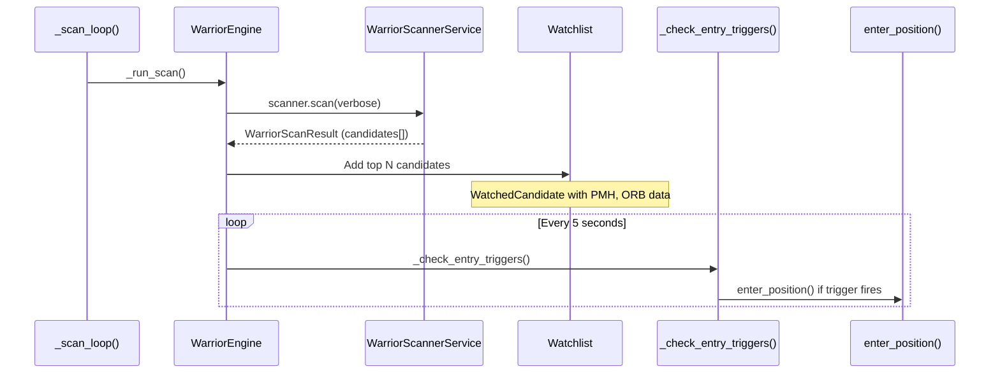
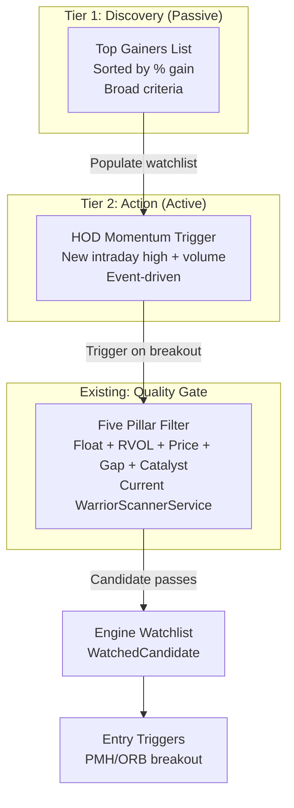

# Dual Scanner Architecture Specification

> **Author:** Backend Planner Agent  
> **Date:** 2026-02-21  
> **Status:** DRAFT — Awaiting Coordinator Review  
> **Input:** [research_ross_dual_scanner.md](file:///c:/Users/ftbbo/Nextcloud4/OneDrive%20Backup/Documents%20(sync'd)/Development/Nexus/nexus2/reports/2026-02-21/research_ross_dual_scanner.md), [handoff_backend_planner_scanner_architecture.md](file:///c:/Users/ftbbo/Nextcloud4/OneDrive%20Backup/Documents%20(sync'd)/Development/Nexus/nexus2/reports/2026-02-21/handoff_backend_planner_scanner_architecture.md)

---

## 1. Executive Summary

Ross Cameron uses **two primary scanners** in tandem:

1. **Top Gainers Scanner** — A passive, sorted discovery list (stocks up ≥10%, ranked by % gain)
2. **High of Day (HOD) Momentum Scanner** — An active, event-driven trigger (fires when a stock makes a new intraday high with volume)

The current Nexus scanner (`WarriorScannerService`) maps to the **Five Pillar Alert Scanner**, which is Ross's secondary/filtering scanner. This spec proposes evolving the architecture into a two-tier system while keeping the existing Five Pillar scanner as the primary quality gate.

---

## 2. Current Architecture

### 2.1 Scanner Code Map

| Component | File | Lines | Purpose |
|-----------|------|-------|---------|
| Settings | [warrior_scanner_service.py](file:///c:/Users/ftbbo/Nextcloud4/OneDrive%20Backup/Documents%20(sync'd)/Development/Nexus/nexus2/domain/scanner/warrior_scanner_service.py#L86-L168) | 86–168 | `WarriorScanSettings` dataclass with all pillar thresholds |
| Scanner Service | [warrior_scanner_service.py](file:///c:/Users/ftbbo/Nextcloud4/OneDrive%20Backup/Documents%20(sync'd)/Development/Nexus/nexus2/domain/scanner/warrior_scanner_service.py#L500-L525) | 500–525 | `WarriorScannerService` class, singleton via `get_warrior_scanner_service()` |
| Main scan() | [warrior_scanner_service.py](file:///c:/Users/ftbbo/Nextcloud4/OneDrive%20Backup/Documents%20(sync'd)/Development/Nexus/nexus2/domain/scanner/warrior_scanner_service.py#L586-L821) | 586–821 | Fetches gainers, deduplicates, pre-filters, evaluates each symbol |
| _evaluate_symbol() | [warrior_scanner_service.py](file:///c:/Users/ftbbo/Nextcloud4/OneDrive%20Backup/Documents%20(sync'd)/Development/Nexus/nexus2/domain/scanner/warrior_scanner_service.py#L823-L1075) | 823–1075 | Sequential 5-pillar check: Float → RVOL → Price → Gap → Catalyst |
| RVOL Hard Gate | [warrior_scanner_service.py](file:///c:/Users/ftbbo/Nextcloud4/OneDrive%20Backup/Documents%20(sync'd)/Development/Nexus/nexus2/domain/scanner/warrior_scanner_service.py#L1288) | 1288 | `if ctx.rvol < s.min_rvol:` — rejects below threshold |
| Telemetry DB Write | [warrior_scanner_service.py](file:///c:/Users/ftbbo/Nextcloud4/OneDrive%20Backup/Documents%20(sync'd)/Development/Nexus/nexus2/domain/scanner/warrior_scanner_service.py#L526-L584) | 526–584 | `_write_scan_result_to_db()` — PASS/FAIL with rejection reason |

### 2.2 Scanner → Entry Engine Pipeline



**Key files in the pipeline:**

| Step | File | Function |
|------|------|----------|
| Scan orchestration | [warrior_engine.py](file:///c:/Users/ftbbo/Nextcloud4/OneDrive%20Backup/Documents%20(sync'd)/Development/Nexus/nexus2/domain/automation/warrior_engine.py#L444-L509) | `_run_scan()` — calls `scanner.scan()`, adds to watchlist |
| Scan loop | [warrior_engine.py](file:///c:/Users/ftbbo/Nextcloud4/OneDrive%20Backup/Documents%20(sync'd)/Development/Nexus/nexus2/domain/automation/warrior_engine.py#L385-L436) | `_scan_loop()` — periodic scanning with configurable interval |
| Watch loop | [warrior_engine.py](file:///c:/Users/ftbbo/Nextcloud4/OneDrive%20Backup/Documents%20(sync'd)/Development/Nexus/nexus2/domain/automation/warrior_engine.py#L580-L638) | `_watch_loop()` — 5-second polling for entry triggers |
| Entry triggers | [warrior_engine_entry.py](file:///c:/Users/ftbbo/Nextcloud4/OneDrive%20Backup/Documents%20(sync'd)/Development/Nexus/nexus2/domain/automation/warrior_engine_entry.py) | `check_entry_triggers()` — PMH/ORB breakout detection |
| Entry execution | [warrior_engine_entry.py](file:///c:/Users/ftbbo/Nextcloud4/OneDrive%20Backup/Documents%20(sync'd)/Development/Nexus/nexus2/domain/automation/warrior_engine_entry.py) | `enter_position()` — risk sizing, order submission |

### 2.3 RVOL Configuration Surface

**Current state:** `min_rvol` is **already API-configurable**.

| Layer | Location | Status |
|-------|----------|--------|
| Setting | `WarriorScanSettings.min_rvol = Decimal("2.0")` ([L111](file:///c:/Users/ftbbo/Nextcloud4/OneDrive%20Backup/Documents%20(sync'd)/Development/Nexus/nexus2/domain/scanner/warrior_scanner_service.py#L111)) | ✅ Exists |
| Hard Gate | `_calculate_rvol_pillar()` at [L1288](file:///c:/Users/ftbbo/Nextcloud4/OneDrive%20Backup/Documents%20(sync'd)/Development/Nexus/nexus2/domain/scanner/warrior_scanner_service.py#L1288) | ✅ Uses `s.min_rvol` |
| API GET | `GET /warrior/scanner/settings` ([L777-793](file:///c:/Users/ftbbo/Nextcloud4/OneDrive%20Backup/Documents%20(sync'd)/Development/Nexus/nexus2/api/routes/warrior_routes.py#L777-L793)) | ✅ Returns `min_rvol` |
| API PUT | `PUT /warrior/scanner/settings` ([L797-815](file:///c:/Users/ftbbo/Nextcloud4/OneDrive%20Backup/Documents%20(sync'd)/Development/Nexus/nexus2/api/routes/warrior_routes.py#L797-L815)) | ✅ Updates `min_rvol` |
| Pydantic Model | `WarriorScannerSettingsRequest.min_rvol` ([L47](file:///c:/Users/ftbbo/Nextcloud4/OneDrive%20Backup/Documents%20(sync'd)/Development/Nexus/nexus2/api/routes/warrior_routes.py#L47)) | ✅ `Optional[float]` |
| Frontend GUI | `warrior.tsx` | ❌ **Missing** — no RVOL slider |
| Persistence | Via `warrior_settings.py` | ⚠️ **Unclear** — engine settings persist, scanner settings may not |

> [!IMPORTANT]
> The RVOL threshold is already configurable via API. The only gap is **frontend GUI control** and potentially **persistence** of the scanner-specific setting (separate from engine config). Lowering `min_rvol` to 1.5x would allow HIND (1.9x RVOL) to pass the scanner.

---

## 3. HIND Test Case Analysis

**HIND (Jan 27, 2026)** — Ross Cameron's $55,252 HIND trade was rejected by the scanner because:

| Metric | Value | Threshold | Result |
|--------|-------|-----------|--------|
| Gap % | 8.7% | ≥5% | ✅ PASS |
| RVOL | ~1.9x | ≥2.0x | ❌ FAIL |
| Float | ~5M | <100M | ✅ PASS |
| Price | ~$5 | $1–$20 | ✅ PASS |
| Catalyst | NEWS | Required | ✅ PASS |

**Fix:** Lowering `min_rvol` from `2.0` to `1.5` (configurable) would allow HIND to pass. This aligns with Ross's methodology — HIND was triggered by the **Top Gainers scanner** (broad criteria) and then the **HOD Momentum scanner** (price action), not the Five Pillar scanner.

> [!NOTE]
> The simulation test (`test_simulation_e2e.py` at [L127](file:///c:/Users/ftbbo/Nextcloud4/OneDrive%20Backup/Documents%20(sync'd)/Development/Nexus/nexus2/tests/integration/test_simulation_e2e.py#L127)) already uses `min_rvol=0.5` to bypass the RVOL gate during testing. This pattern confirms the setting is functional.

---

## 4. Proposed Two-Tier Architecture

### 4.1 Architecture Overview



### 4.2 Tier 1: Top Gainers Scanner

**Purpose:** Broad discovery list — what's moving today?

| Criterion | Value | Source |
|-----------|-------|--------|
| % Change | ≥10% up from prior close | Ross transcript evidence |
| RVOL | ≥1.5x (soft, configurable) | Research inference — looser than Five Pillar |
| Float | <20M (ideal), <100M (max) | Ross stated criteria |
| Price | $1–$20 range | Ross stated criteria |
| News | Preferred but not required | Ross trades "momentum" without news sometimes |

**Implementation approach:**
- Reuse existing `scan()` method's gainer-fetching logic (Polygon + FMP + Alpaca sources)
- Apply lighter pre-filters (no catalyst requirement, softer RVOL)
- Return a **ranked list** (not pass/fail), sorted by quality score
- This list feeds the GUI watchlist panel and the HOD Momentum Trigger

### 4.3 Tier 2: HOD Momentum Scanner

**Purpose:** Event-driven trigger — fires when a watched stock makes a new intraday high with sufficient volume.

| Criterion | Evidence | Notes |
|-----------|----------|-------|
| New HOD break | Stock price exceeds session_high | Core trigger |
| Volume confirmation | Current-bar volume > average 1-min volume | Prevents low-volume fakeouts |
| On Top Gainers list | Must be in Tier 1 results | Pre-qualification |
| Rate of change | Rapid price acceleration | Ross looks for "fast moves" |

**Implementation approach:**
- Leverage the existing `_watch_loop()` (5-second polling) in `WarriorEngine`
- Add HOD break detection as a new `EntryTriggerType` alongside existing PMH and ORB
- The existing `session_high` tracking in `WatchedCandidate` provides the data
- Volume confirmation via `get_intraday_bars()` callback already wired

### 4.4 How the Tiers Interact

```
Pre-Market (4 AM – 9:30 AM):
  1. Top Gainers Scanner runs periodically (existing _scan_loop)
  2. Results populate engine watchlist (existing _run_scan flow)
  3. Five Pillar filter applied at scan time (existing _evaluate_symbol)

Market Hours (9:30 AM – 11:30 AM):  
  1. HOD Momentum Trigger monitors all watched candidates (enhanced _watch_loop)
  2. When stock breaks HOD with volume → entry trigger fires
  3. Entry guards + risk sizing → order submission (existing enter_position)
```

---

## 5. Implementation Phases

### Phase 1: RVOL Configurability + HIND Fix (Small, Safe)

**Changes:**
1. Add RVOL slider to `warrior.tsx` Scanner Settings card (frontend)
2. Ensure scanner settings persist via `warrior_settings.py` (verify/add)
3. Update HIND test to verify it passes with `min_rvol=1.5`

**Risk:** Minimal — all backend infrastructure already exists.

### Phase 2: Top Gainers View (Medium)

**Changes:**
1. Add a `scan_top_gainers()` method to `WarriorScannerService` (or a new `TopGainersScanner`)
   - Reuses gainer-fetching logic
   - Applies lighter filters (no catalyst requirement, configurable RVOL)
   - Returns ranked list
2. New API endpoint: `GET /warrior/scanner/top-gainers`
3. Frontend: Top Gainers list panel in warrior dashboard

**Risk:** Low-medium — mostly additive, no changes to existing scan pipeline.

### Phase 3: HOD Momentum Trigger (Medium-Large)

**Changes:**
1. New `EntryTriggerType.HOD_BREAK` enum value
2. HOD detection in `_watch_loop` / `check_entry_triggers()`
3. Volume confirmation logic (current-bar volume vs average)
4. Telemetry: log HOD break events for analysis
5. Frontend: HOD trigger indicator in watchlist panel

**Risk:** Medium — affects the entry pipeline. Requires careful testing with Mock Market.

---

## 6. Open Questions for Coordinator

1. **Phase priority:** Should Phase 1 (RVOL + HIND fix) be implemented immediately, or wait for the full two-tier spec approval?

2. **Separate scanner class vs. mode flag?** Should the Top Gainers scanner be:
   - (A) A separate class (`TopGainersScanner`) with its own settings
   - (B) A scan mode within `WarriorScannerService` (e.g., `scan(mode="top_gainers")`)
   - Recommendation: **(B)** — avoids duplication since 80% of the logic (gainer fetching, pre-filtering) is shared.

3. **HOD Momentum — polling vs. streaming?** The current architecture uses 5-second polling. Ross's HOD trigger may require faster detection. Options:
   - (A) Reduce poll interval to 1 second for HOD detection
   - (B) Use WebSocket streaming for real-time price updates
   - Recommendation: **(A)** for now — simpler, and 1-second polling is fast enough for most breakouts.

4. **Frontend location:** Should the Top Gainers list live in:
   - (A) The existing warrior dashboard page
   - (B) A new dedicated scanner page
   - (C) A collapsible panel within the warrior page

5. **Scanner settings persistence gap:** The engine config persists via `warrior_settings.py`, but scanner-specific settings (like `min_rvol`) may not survive restarts when changed via the scanner settings API. Need to verify whether `PUT /warrior/scanner/settings` persists changes or only holds them in memory.

---

## 7. Test Surface

### Existing Tests Affected

| Test File | Relevance |
|-----------|-----------|
| [test_warrior_scanner.py](file:///c:/Users/ftbbo/Nextcloud4/OneDrive%20Backup/Documents%20(sync'd)/Development/Nexus/nexus2/tests/unit/scanners/test_warrior_scanner.py) | Tests `WarriorScanSettings` defaults (L38: asserts `min_rvol == 2.0`) |
| [test_warrior_scanner_pillars.py](file:///c:/Users/ftbbo/Nextcloud4/OneDrive%20Backup/Documents%20(sync'd)/Development/Nexus/nexus2/tests/unit/scanners/test_warrior_scanner_pillars.py) | Tests individual pillar checks |
| [test_scanner_validation.py](file:///c:/Users/ftbbo/Nextcloud4/OneDrive%20Backup/Documents%20(sync'd)/Development/Nexus/nexus2/tests/test_scanner_validation.py) | End-to-end scanner validation with `WarriorScanSettings()` |
| [test_simulation_e2e.py](file:///c:/Users/ftbbo/Nextcloud4/OneDrive%20Backup/Documents%20(sync'd)/Development/Nexus/nexus2/tests/integration/test_simulation_e2e.py) | Already uses `min_rvol=0.5` (L127) |
| [test_warrior_routes.py](file:///c:/Users/ftbbo/Nextcloud4/OneDrive%20Backup/Documents%20(sync'd)/Development/Nexus/nexus2/tests/api/test_warrior_routes.py) | Tests scanner settings API (L221: `mock_engine.scanner.settings.min_rvol = 2.0`) |

### New Tests Needed (Phase 1)

1. **RVOL configurability test:** Verify `WarriorScanSettings(min_rvol=Decimal("1.5"))` allows symbols with 1.5x-2.0x RVOL to pass
2. **HIND-specific test:** Configure scanner with `min_rvol=1.5`, verify HIND candidate passes
3. **API round-trip test:** `PUT /warrior/scanner/settings` with `min_rvol=1.5`, then `GET` confirms it persisted

---

*End of specification.*
