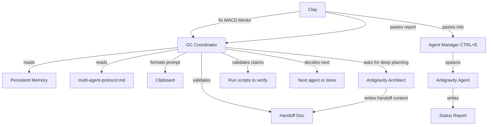

# Plan: GC as Multi-Agent Coordinator

## The Problem

Antigravity (Claude) currently serves as the multi-agent coordinator, but has critical weaknesses:
- **Amnesia** — Forgets coordinator rules every session
- **No verification** — Trusts agent reports, can't run scripts to verify
- **No autonomy** — Writes prompts for Clay to manually paste into Agent Manager
- **Protocol drift** — Keeps making the same mistakes (wrong @agent paths, bare filenames)

## The Vision

GC replaces Antigravity as the **coordination layer**. Antigravity becomes a **specialist** (architecture, deep planning, complex code reasoning).

```
CURRENT:  Clay → Antigravity (coordinator) → writes handoff → Clay pastes → Agent → Clay relays results
PROPOSED: Clay → GC (coordinator) → validates + prompts → Clay pastes → Agent → Clay feeds results to GC → GC validates
```

## Architecture



### Role Split

| Role | Owner | What They Do |
|------|-------|-------------|
| **Coordinator** | GC | Protocol enforcement, workflow tracking, validation, number verification |
| **Architect** | Antigravity | Deep planning, strategy assessment, complex code reasoning, handoff content |
| **Specialists** | Antigravity Agents | Code editing, testing, implementation |
| **Decision Maker** | Clay | Approvals, direction, final call |

### Workflow State Machine

GC tracks multi-agent workflows in a state file:

```json
{
  "workflow": "MACD Block Analysis", 
  "state": "VALIDATING",
  "steps": [
    {"agent": "backend-planner", "status": "COMPLETE", "report": "spec_macd_block_analysis.md"},
    {"agent": "backend", "status": "COMPLETE", "report": "backend_status_macd_blocks.md"},
    {"agent": "testing", "status": "PENDING", "handoff": null}
  ],
  "next_action": "Validate backend specialist claims, then spawn testing specialist"
}
```

---

## MVP (Testable in ~1 Hour)

### What We Build

3 new GC capabilities, all achievable with system prompt instructions + existing tools:

#### 1. `spawn agent` Command (system prompt pattern)
GC runs `spawn_agent.py` via `shell_exec` when Clay says "spawn agent X ...".
- Validates handoff
- Formats prompt
- Copies to clipboard
- **Implementation:** 5 lines in `BASE_SYSTEM_PROMPT`

#### 2. `agent done` Command (new)
When an agent finishes, Clay pastes the summary into GC: "agent done: [paste report summary]".
GC:
- Saves the report to memory
- Checks if validation is needed (per the implementer→validator table)
- Suggests next step: "Spawn validator?" or "Workflow complete"
- **Implementation:** System prompt pattern + memory_save

#### 3. `workflow status` Command (new)
Clay asks "workflow status" and GC shows the current multi-agent pipeline state.
- Which agents have run
- What's pending
- What's blocking
- **Implementation:** GC tracks in memory_save with tag "workflow"

### What We DON'T Build (Yet)

- ❌ GC automatically writing handoff content (still needs Antigravity for deep planning)
- ❌ GC automatically pasting into Agent Manager (no API)
- ❌ GC running swarm sub-agents for validation (keep simple first)

### Test Scenario

Use the current MACD block analysis workflow:

1. Clay: `spawn agent backend nexus2/reports/2026-02-24/spec_macd_block_analysis.md --task "Implement analyze_macd_blocks.py"`
2. GC validates handoff → formats prompt → clipboard → Clay pastes
3. Backend specialist works...
4. Clay: `agent done: Backend specialist created scripts/analyze_macd_blocks.py. Claims: parses histogram from guard blocks, classifies into 3 buckets, runs counterfactual P&L.`
5. GC: "Got it. Per protocol, backend implementations need validation by Testing Specialist. Want me to format the validator spawn? The handoff would reference the backend's claims."
6. Clay: Yes
7. GC spawns validator prompt → clipboard
8. Clay pastes, validator runs
9. Clay: `agent done: Validator confirms 5/5 claims. All PASS.`
10. GC: "✅ Workflow complete. MACD block analysis ready. Run the script?"

---

## Implementation Steps

### Step 1: System Prompt Update (`agent-loop.ts`)
Add 3 command patterns to `BASE_SYSTEM_PROMPT` lines 89-100:

```
"spawn agent <type> <path>" → Run spawn_agent.py via shell_exec, show output
"agent done" → Save report to memory, check validator pairing, suggest next step  
"workflow status" → Show tracked workflow state from memory
```

### Step 2: Update Memory File
Add workflow tracking instructions to `multi-agent-protocol.md`:
- How to save workflow state
- How to check implementer→validator pairings
- Templates for "suggest next step" responses

### Step 3: Test
Run the MACD block analysis workflow end-to-end through GC.

---

## Future Enhancements (Post-MVP)

1. **Handoff generation** — GC asks Antigravity (via MCP) to write handoff content, GC adds protocol formatting
2. **Auto-validation** — GC uses swarm sub-agents to run pytest or verification scripts
3. **Agent Manager CLI** — If Antigravity adds a CLI for spawning agents, GC can spawn directly
4. **Dashboard** — GC Telegram bot shows workflow status with inline buttons
