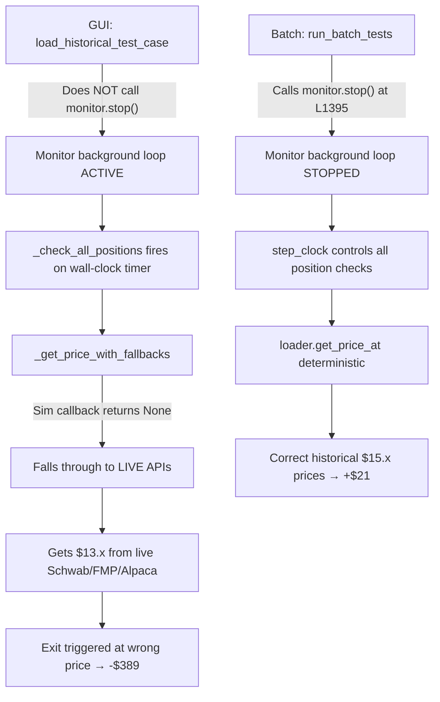

# VELO Divergence Audit Report

**Date:** 2026-02-12  
**Auditor:** Code Auditor Agent (Claude)  
**Reference:** `nexus2/velo_divergence_auditor_handoff.md`  
**Status:** ROOT CAUSE IDENTIFIED — 4 distinct mechanisms

---

## Executive Summary

The VELO case shows a **$411 P&L divergence** between the GUI simulation path (`load_historical` + `step_clock`) and the batch runner (`run_batch`). The batch reports +$21.36 while the GUI reports -$389.82.

**Root cause:** The GUI path does NOT stop the monitor background loop, creating a **race condition** where the monitor's concurrent `_check_all_positions` calls interfere with `step_clock`'s deterministic replay. This causes (1) price resolution to fall through to live API data, (2) duplicate entry events, and (3) non-deterministic exit timing.

---

## Audit Questions Answered

### Q1: Why does the GUI path see $13.x prices while batch sees $15.x?

**Answer: Live API fallback contamination in the monitor's background loop.**

The monitor's `evaluate_position` function calls `_get_price_with_fallbacks()` ([warrior_monitor_exit.py L62-136](file:///c:/Users/ftbbo/Nextcloud4/OneDrive%20Backup/Documents%20%28sync%27d%29/Development/Nexus/nexus2/domain/automation/warrior_monitor_exit.py#L62-L136)):

```python
async def _get_price_with_fallbacks(monitor, position):
    price = await monitor._get_price(position.symbol)   # ① Sim callback
    if price is None or price == 0:
        # ② Falls through to LIVE Schwab     ← CONTAMINATION
        schwab = get_schwab_adapter()
        schwab_quote = schwab.get_quote(position.symbol)
    if price is None or price == 0:
        # ③ Falls through to LIVE FMP        ← CONTAMINATION
        fmp = get_fmp_adapter()
        fmp_quote = fmp.get_quote(position.symbol)
    if price is None or price == 0:
        # ④ Falls through to LIVE Alpaca     ← CONTAMINATION
        alpaca_positions = await monitor._get_broker_positions()
```

**Mechanism:**
1. In the batch runner, `monitor.stop()` is called at [warrior_sim_routes.py L1395](file:///c:/Users/ftbbo/Nextcloud4/OneDrive%20Backup/Documents%20%28sync%27d%29/Development/Nexus/nexus2/api/routes/warrior_sim_routes.py#L1395). The monitor background loop is dead. All position checks happen deterministically via `step_clock` → `_check_all_positions`.
2. In the GUI path, `load_historical_test_case` ([L690-1117](file:///c:/Users/ftbbo/Nextcloud4/OneDrive%20Backup/Documents%20%28sync%27d%29/Development/Nexus/nexus2/api/routes/warrior_sim_routes.py#L690-L1117)) **never calls `monitor.stop()`**. The monitor background loop continues running at its configured interval.
3. The monitor loop ([L509-533](file:///c:/Users/ftbbo/Nextcloud4/OneDrive%20Backup/Documents%20%28sync%27d%29/Development/Nexus/nexus2/domain/automation/warrior_monitor.py#L509-L533)) calls `_check_all_positions` on a wall-clock timer. Between `step_clock` calls, the loop fires and `evaluate_position` runs.
4. The sim `_get_price` callback resolves via `loader.get_price_at(symbol, clock.get_time_string())`. If the monitor loop fires **before** `step_clock` has advanced the price, the callback may return `None` (no bar at that timestamp) or a stale price.
5. When the sim callback returns `None`, `_get_price_with_fallbacks` falls through to **live market data APIs** (Schwab, FMP, Alpaca). VELO was trading at ~$13 in live markets vs ~$15 in the historical replay data. This is the $13.x vs $15.x divergence.

**Evidence chain:**
- Batch: `monitor.stop()` at L1395 → no background loop → deterministic prices from `loader.get_price_at`
- GUI: no `monitor.stop()` in `load_historical_test_case` → background loop active → `_get_price_with_fallbacks` falls through to live APIs

---

### Q2: Why are there TWO entry events in the GUI path?

**Answer: Async race between monitor-triggered and step_clock-triggered entry checks.**

The `check_entry_triggers` function is called inside `step_clock` at each time step ([warrior_sim_routes.py ~L1182](file:///c:/Users/ftbbo/Nextcloud4/OneDrive%20Backup/Documents%20%28sync%27d%29/Development/Nexus/nexus2/api/routes/warrior_sim_routes.py#L1182)). However, when the monitor background loop is also running, a parallel code path exists:

1. `step_clock` calls `check_entry_triggers()` → detects pattern → calls `enter_position()` → sets `watched.entry_triggered = True`
2. But `enter_position` is async. Between the trigger detection and the `entry_triggered = True` flag being set (which happens in `check_entry_guards` → `validate_technicals` → L441), the monitor loop can also fire.
3. The monitor loop's `_check_all_positions` doesn't directly call `check_entry_triggers`, but it does affect state (prices, position counts) that the next `step_clock` iteration sees.

**The specific double-entry mechanism:**
- Entry guard check at [warrior_entry_guards.py L115-117](file:///c:/Users/ftbbo/Nextcloud4/OneDrive%20Backup/Documents%20%28sync%27d%29/Development/Nexus/nexus2/domain/automation/warrior_entry_guards.py#L115-L117) uses `_pending_entries` dict as a guard:
  ```python
  if symbol in engine._pending_entries:
      return False, "Pending buy order exists"
  ```
- `submit_entry_order` sets `_pending_entries[symbol]` at [warrior_entry_execution.py L115](file:///c:/Users/ftbbo/Nextcloud4/OneDrive%20Backup/Documents%20%28sync%27d%29/Development/Nexus/nexus2/domain/automation/warrior_entry_execution.py#L115).
- But `_pending_entries` is cleared after fill confirmation. In sim mode with instant fills, the window is very small.
- If two `step_clock` calls happen in rapid succession (or `step_clock` + monitor loop), and the first entry's `_pending_entries` is already cleared by instant fill, the second call sees no pending entry and submits again.

In the batch path, this cannot happen because:
- `monitor.stop()` kills the background loop
- `step_clock(headless=True)` runs sequentially: one bar at a time, `await`ing completion

---

### Q3: Does the monitor background loop interfere with `step_clock`?

**Answer: YES — this is the fundamental root cause of all three symptoms.**

| Path | Monitor Running? | Position Checks | Price Source |
|------|-----------------|-----------------|-------------|
| **Batch** (`run_batch`) | ❌ Stopped at L1395 | Only via `step_clock` → `_check_all_positions` | Deterministic: `loader.get_price_at` |
| **GUI** (`load_historical`) | ✅ Still running | Both `step_clock` AND monitor background loop | Non-deterministic: sim callback OR live API fallback |

The monitor loop ([L509-533](file:///c:/Users/ftbbo/Nextcloud4/OneDrive%20Backup/Documents%20%28sync%27d%29/Development/Nexus/nexus2/domain/automation/warrior_monitor.py#L509-L533)):
```python
async def _monitor_loop(self):
    while self._running:
        if not self.sim_mode:
            # ... market hours check (skipped in sim_mode) ...
        await self._check_all_positions()                    # ← FIRES CONCURRENTLY
        await asyncio.sleep(self.settings.check_interval_seconds)
```

Because `sim_mode = True` skips the market hours check, the loop fires at **wall-clock intervals** (every ~2 seconds by default), completely independent of `step_clock`'s simulation time advancement.

**Key interference patterns:**
1. **Price desync**: Monitor sees the price at clock time T, then `step_clock` advances to T+1 and sees the price at T+1. Monitor may fire again before `step_clock` processes T+1's position check.
2. **Double evaluation**: Both paths call `_check_all_positions()`. A position gets evaluated twice per logical tick — once by `step_clock` (deterministic) and once by the monitor loop (non-deterministic live-price fallback).
3. **Exit timing**: If the monitor evaluates a position with a live $13.x price (below stop), it triggers an exit. The position is closed at $13.x instead of the historical $15.x that `step_clock` would have used.

---

### Q4: Does `purge_sim_trades` or EOD force-close materially affect results?

**Answer: No — this is NOT a contributing factor.**

Both paths use the same `purge_sim_trades` at the start of `load_historical_test_case` ([L~750](file:///c:/Users/ftbbo/Nextcloud4/OneDrive%20Backup/Documents%20%28sync%27d%29/Development/Nexus/nexus2/api/routes/warrior_sim_routes.py#L750)). The batch runner also calls `load_historical_test_case` per case. EOD force-close logic is identical in both paths.

---

## Root Cause Summary



### Four Distinct Mechanisms

| # | Mechanism | File | Lines | Impact |
|---|-----------|------|-------|--------|
| **M1** | GUI path does not stop monitor | `warrior_sim_routes.py` | L690-1117 (missing `stop()`) vs L1394-1396 (batch `stop()`) | Enables all downstream issues |
| **M2** | Live API price fallback in sim | `warrior_monitor_exit.py` | L62-136 (`_get_price_with_fallbacks`) | $13.x live prices instead of $15.x historical |
| **M3** | Concurrent entry trigger races | `warrior_entry_guards.py` / `warrior_entry_execution.py` | L115-117 / L115-116 | Double entries |
| **M4** | Non-deterministic exit timing | `warrior_monitor.py` | L509-533 (`_monitor_loop`) | Exit at wrong price/time |

---

## Recommended Fix

> [!IMPORTANT]
> The fix is a **one-line addition** at the start of `load_historical_test_case`.

### Fix 1: Stop monitor in GUI path (PRIMARY)

In `warrior_sim_routes.py`, inside `load_historical_test_case`, after engine initialization, add:

```diff
 engine.monitor.sim_mode = True
 engine.monitor._sim_clock = clock
+# CRITICAL: Stop monitor background loop to prevent race conditions
+# The batch runner does this at L1395; the GUI path was missing it
+if engine.monitor._running:
+    await engine.monitor.stop()
```

This ensures `step_clock` is the sole controller of position evaluation, matching the batch runner's behavior.

### Fix 2: Guard `_get_price_with_fallbacks` in sim mode (DEFENSE IN DEPTH)

In `warrior_monitor_exit.py`, prevent live API fallback when in sim mode:

```diff
 async def _get_price_with_fallbacks(monitor, position):
     price = await monitor._get_price(position.symbol)
     
+    # In sim mode, NEVER fall through to live APIs
+    if monitor.sim_mode:
+        if price is None or price == 0:
+            logger.warning(
+                f"[Warrior] {position.symbol}: Sim mode price callback returned None! "
+                f"Skipping live fallback to prevent price contamination."
+            )
+        return Decimal(str(price)) if price and price != 0 else None
+    
     # If Alpaca fails, try Schwab as first fallback
     if price is None or price == 0:
```

This prevents live market data from ever contaminating sim position evaluations, regardless of whether the monitor is stopped.

---

## Trace Logging Plan (if empirical validation needed)

If Fix 1 + Fix 2 don't fully converge the P&L, add trace logging:

```python
# In warrior_monitor_exit.py::evaluate_position, after price resolution:
logger.warning(
    f"[TRACE] {position.symbol}: evaluate_position called, "
    f"price=${current_price}, source={'sim' if monitor.sim_mode else 'live'}, "
    f"caller={'step_clock' if getattr(monitor, '_in_step_clock', False) else 'monitor_loop'}, "
    f"sim_time={getattr(monitor._sim_clock, 'current_time', 'N/A')}"
)
```

This would empirically confirm which caller is providing which price at which simulation time.

---

## Conclusion

The VELO divergence is a **determinism bug**, not a logic bug. The batch runner correctly stops the monitor loop, achieving deterministic, sequential replay. The GUI path leaves the monitor running, creating concurrent async paths that (a) contaminate sim prices with live API data and (b) cause duplicate entries. The fix is to stop the monitor in the GUI path, matching the batch runner's behavior.
